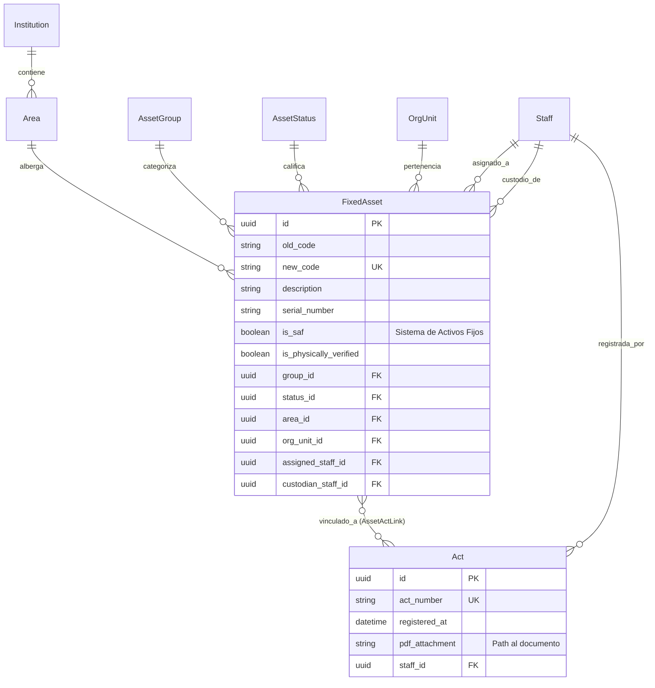

# Assets Module Guide - Fixed Assets & Inventory

Este documento detalla la arquitectura, el modelo de datos y la gestión de activos fijos del sistema, incluyendo su relación con el personal y la infraestructura organizacional.

## 1. Arquitectura Modular (Aplanada)

El módulo de Activos ha sido refactorizado siguiendo el estándar de **Nested Routing** y **Aplanamiento Estructural**, dividiéndose en 6 submódulos especializados.

### Estructura de Archivos
```text
app/modules/assets/
├── routers.py          # Agregador raíz (Nested Router)
├── institutions/       # Entes gubernamentales
├── areas/             # Áreas geográficas/físicas
├── groups/            # Categorización de bienes (Grupos)
├── statuses/          # Estado de conservación
├── acts/              # Gestión de Actas (M2M Link)
└── assets/            # Entidad principal (Bienes/Activos)
    ├── models.py      # Modelo FixedAsset
    ├── repository.py
    ├── service.py
    ├── schemas.py
    └── routers.py      # /assets/assets
```

---

## 2. Diagrama Entidad-Relación (ERD)



---

## 3. Características Avanzadas

### CRUD Estandarizado
Cada submódulo hereda de `BaseRepository` y soporta las siguientes operaciones:
- **POST `/`**: Creación.
- **GET `/`**: Listado paginado con soporte PrimeNG (`offset`, `limit`, `sort_by`, `sort_order`).
- **GET `/count`**: Conteo para paginación global.
- **GET `/{id}`**: Obtención individual.
- **PATCH `/{id}`**: Actualización parcial inteligente.
- **DELETE `/{id}`**: Eliminación física (verificar integridad referencial).

### Gestión de Actas (Many-to-Many)
La relación entre Actas y Activos se gestiona mediante el modelo `AssetActLink` ubicado en `app/modules/assets/acts/models.py`. Este modelo permite que un activo mantenga su historial documental íntegro a lo largo de su ciclo de vida.

---

## 4. Guía de Integración (RBAC)

Todos los submódulos utilizan el slug global `assets` para el control de permisos.
- Permiso `READ`: Acceso a listados y detalles.
- Permisos `CREATE/UPDATE/DELETE`: Acceso a operaciones de escritura.

---

> [!TIP]
> Para añadir un nuevo campo al modelo de activos, recuerda actualizar tanto el modelo en `assets/assets/models.py` como los esquemas de lectura y actualización en `assets/assets/schemas.py`.
