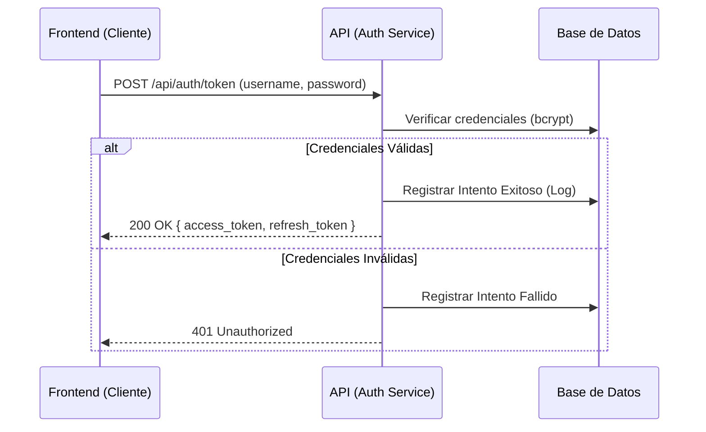
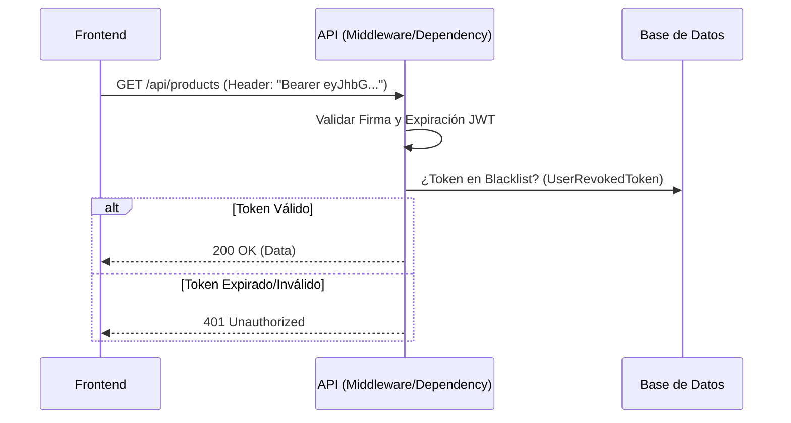
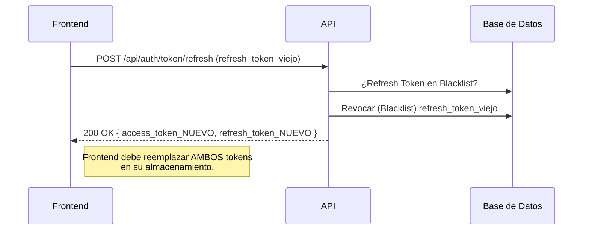
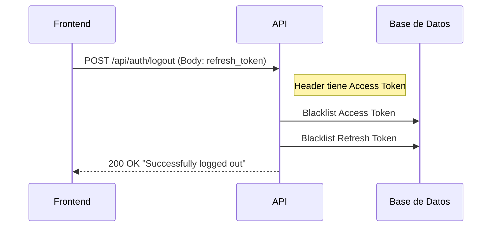

# Guía de Autenticación y Seguridad (Enterprise)

Esta guía detalla la arquitectura de seguridad del sistema, basada en estándares modernos (OAuth2, JWT, Token Rotation) y diseñada para escalabilidad y robustez bancaria.

Está dirigida tanto a **Desarrolladores Backend** (para implementación de seguridad en módulos) como a **Desarrolladores Frontend** (para la correcta integración del cliente).

---

## 🏗️ Arquitectura de Seguridad

El sistema utiliza una arquitectura **Stateless** (sin estado) basada en **JWT (JSON Web Tokens)** con las siguientes características de seguridad reforzada:

1.  **Access Token**: Token JWT de vida corta (ej. 15 min). Se envía en cada petición (`Authorization: Bearer <token>`).
2.  **Refresh Token**: Token de vida larga (ej. 7 días). Se usa *únicamente* para obtener nuevos Access Tokens cuando el anterior expira.
3.  **Token Rotation (RTR)**: Cada vez que se usa un Refresh Token, este se **elimina** (invalida) y se entrega uno nuevo. Esto previene el robo de sesión persistente.
4.  **Blacklist (Revocación)**: Tabla en base de datos (`UserRevokedToken`) para "matar" tokens inmediatamente (Logout o robo detectado).
5.  **Hashing Robusto**: Contraseñas almacenadas con `bcrypt`.

---

## 🔄 Flujos de Funcionamiento (Diagramas)

### 1. Login (Inicio de Sesión)



### 2. Petición Protegida



### 3. Renovación de Token (Rotation)

Este flujo se ejecuta automáticamente en el Frontend cuando recibe un 401 o detecta que el Access Token expiró.



### 4. Logout (Cierre de Sesión Seguro)



---

## 👨‍💻 Guía para Backend (Implementación)

### Cómo proteger una ruta nueva
Para asegurar que un endpoint solo sea accesible por usuarios autenticados, inyecta la dependencia `get_current_user`.

```python
from fastapi import APIRouter, Depends
from app.auth.utils import get_current_user
from app.auth.schemas import User

router = APIRouter()

@router.get("/mi-endpoint-seguro")
def secure_data(current_user: User = Depends(get_current_user)):
    # Si llega aquí, el usuario es válido y está autenticado.
    # 'current_user' contiene los datos del usuario (id, username, roles, etc.)
    return {"message": f"Hola {current_user.username}, tienes acceso."}
```

### Cómo obtener el usuario actual
La variable `current_user` inyectada ya contiene el modelo `User` validado. Úsala para lógica de negocio (ej. filtrar datos por `current_user.id`).

---

## 🎨 Guía para Frontend (Integración)

### 1. Almacenamiento de Tokens
*   **Access Token**: Guardar en memoria (variable de estado) o `HttpOnly Cookie` (si es posible). Evitar `localStorage` si se maneja información muy sensible (XSS risk), aunque es aceptable para apps estándar si se sanitizan inputs.
*   **Refresh Token**: Guardar en `HttpOnly Cookie` (Recomendado) o almacenamiento seguro cifrado.

### 2. Interceptores (Axios / Fetch)
El frontend debe implementar un **Interceptor HTTP** para manejar la rotación transparente:

1.  Hacer petición normal con `Access Token`.
2.  Si respuesta es `401 Unauthorized`:
    *   **Pausar** peticiones pendientes.
    *   Llamar a `/api/auth/token/refresh` con el `Refresh Token` actual.
    *   Si Refresh es exitoso:
        *   Guardar **nuevos** tokens.
        *   Reintentar la petición original con el nuevo token.
    *   Si Refresh falla (401/403):
        *   **Forzar Logout** (redirigir a Login).

### 3. Logout
Siempre llamar al endpoint de logout enviando el `refresh_token` en el body para asegurar que la sesión se invalide completamente en el servidor.

```javascript
// Ejemplo de llamada Logout
await api.post('/auth/logout', {
  refresh_token: currentRefreshToken
});
// Luego limpiar storage local
```
