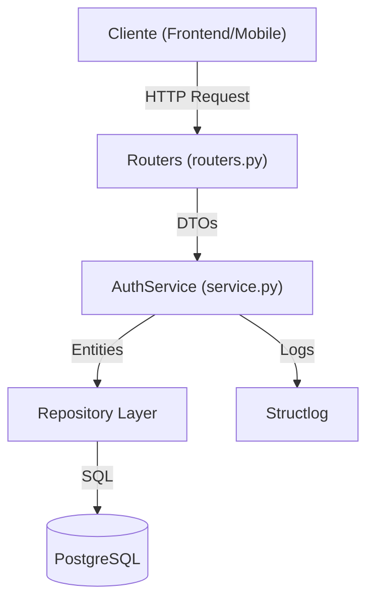
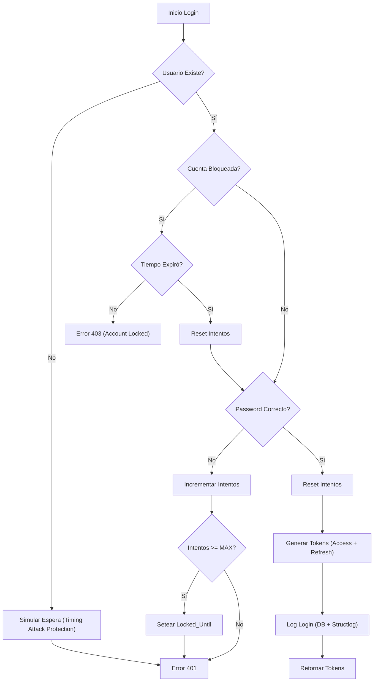
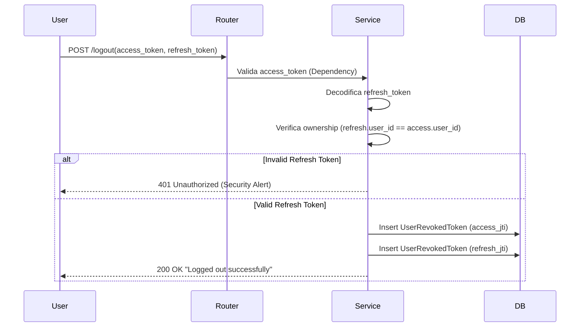

# Guía de Arquitectura de Autenticación y Seguridad

**"The Auth Bible"** - Guía definitiva para desarrolladores del Backend Uyuni.

> [!NOTE]
> Este documento describe la arquitectura de seguridad implementada en `app/auth/`. Lectura obligatoria para contribuir al módulo.

---

## 1. Visión General y Estándares

El módulo de autenticación ha sido diseñado siguiendo principios de **Arquitectura Empresarial** y **Clean Code**. No es solo un sistema de login; es un framework de seguridad robusto que implementa:

*   **Defensa en Profundidad**: Múltiples capas de seguridad (Lockout, JWT Rotation, Blacklist).
*   **Single Responsibility Principle (SRP)**: Cada clase y método tiene una única razón para cambiar.
*   **Type Safety**: Definiciones estrictas con Python Typing (`mypy` compliant).
*   **Auditoría Completa**: Trazabilidad de accesos exitosos y fallidos.

### Tecnologías Core
*   **FastAPI + Pydantic**: Validación de datos y esquemas.
*   **OAuth2 + JWT (Bearer)**: Estándar para APIs REST stateless.
*   **Passlib (Bcrypt)**: Hassing seguro de contraseñas.
*   **PostgreSQL**: Persistencia de usuarios y logs.

---

## 2. Arquitectura del Módulo (`app/auth/`)

El módulo sigue una estructura en capas (Layered Architecture) para desacoplar responsabilidades.



### Componentes Clave

1.  **Routers (`routers.py`)**:
    *   **Responsabilidad**: Solo definición de endpoints HTTP (GET, POST).
    *   **Función**: Recibe requests, extrae datos, llama al Servicio y devuelve respuestas HTTP.
    *   **Regla**: ¡NO debe contener lógica de negocio! Solo orquestación básica.

2.  **Service (`service.py`)**:
    *   **Responsabilidad**: El corazón de la lógica de negocio.
    *   **Función**: Validaciones complejas (lockout, password match), generación de tokens, auditoría.
    *   **Diseño**: Refactorizado en métodos atómicos para facilitar tests y lectura.

3.  **Models (`app/models/user.py`)**:
    *   **Responsabilidad**: Definición de tablas de base de datos.
    *   **Entidades**:
        *   `User`: Datos principales, contadores de intentos (`failed_login_attempts`), estado de bloqueo (`locked_until`).
        *   `UserLogLogin`: Historial de accesos (IP, User-Agent, Token ID).
        *   `UserRevokedToken`: Blacklist de tokens quemados.

4.  **Utils (`utils.py`) & Config (`app/core/config.py`)**:
    *   **Responsabilidad**: Funciones puras (hashing) y configuración estática.

---

## 3. Lógica Detallada de Seguridad

### A. Protección Anti-Bruteforce (Account Lockout)
Implementamos un mecanismo de bloqueo temporal para mitigar ataques de fuerza bruta.

*   **Configuración**:
    *   `SECURITY_LOGIN_MAX_ATTEMPTS`: Intentos permitidos (Default: 5).
    *   `SECURITY_LOCKOUT_MINUTES`: Duración del bloqueo (Default: 15 min).
*   **Flujo**:
    1.  Si `failed_login_attempts` >= MAX, se revisa `locked_until`.
    2.  Si el usuario está bloqueado y el tiempo no ha expirado -> **403 Forbidden**.
    3.  Si la contraseña falla -> Incrementa contador. Si llega al MAX -> Setea `locked_until`.
    4.  Si el login es exitoso -> Resetea contador y `locked_until` a NULL.

### B. Rotación de Tokens y Logout Seguro
Usamos pares de **Access Token** (corto plazo) y **Refresh Token** (largo plazo).

*   **Access Token**: 15 minutos. Stateless. Se usa para cada request.
*   **Refresh Token**: 7 días. Stateful (se valida en BD). Se usa SOLO para obtener nuevos access tokens.
*   **Logout Hardening**:
    *   El endpoint `/logout` **requiere autenticación**.
    *   Valida que el `refresh_token` enviado pertenezca al usuario del `access_token`.
    *   Si es válido, revoca AMBOS tokens añadiéndolos a `UserRevokedToken` (Blacklist).

C. Personificación de Roles (Context Switching)
Para soportar interfaces complejas donde el usuario puede "cambiar de rol", el backend acepta un header opcional `X-Active-Role`.

*   **Sin Header**: Se aplican **todos** los permisos de todos los roles activos del usuario (Unión).
*   **Con Header**: Se aplican **únicamente** los permisos del rol especificado.
    *   **Seguridad**: Si el usuario envía un rol que no tiene asignado, recibe `403 Forbidden`.

---

## 4. Diagramas de Flujo

### Diagrama de Login (Happy & Sad Path)



### Diagrama de Logout Seguro



---

## 5. Guía de Desarrollo (Coding Standards)

Si vas a modificar `AuthService`, sigue estas reglas:

### 1. Naming Conventions
*   **Métodos Públicos (Interface)**: Verbos claros, snake_case.
    *   Ej: `login_for_access_token`, `refresh_access_token`.
*   **Métodos Privados (Helpers)**: Prefijo `_`.
    *   Ej: `_check_account_lockout`, `_handle_failed_login`.

### 2. Typing Estricto
Usamos `mypy`. Todo argumento y retorno debe tener tipo.

```python
# ✅ CORRECTO
def _check_account_lockout(self, user: User) -> None:
    ...

# ✅ CORRECTO (Si lanza excepción y corta flujo)
from typing import NoReturn
def _raise_invalid_credentials(self) -> NoReturn:
    raise HTTPException(...)
```

### 3. Manejo de Errores
*   **Prioridad**: Usa Excepciones de Dominio definidas en `app/core/exceptions.py` (ej. `UnauthorizedException`, `ForbiddenException`).
*   **Evita**: `HTTPException` directa, para desacoplar la lógica de negocio del framework HTTP.
*   **Nunca** devuelvas `None` para indicar error; levanta una excepción.

### 4. Configuración
Nunca hardcodees valores. Usa `app/core/config.py`.

```python
# ❌ MAL
max_attempts = 5

# ✅ BIEN
max_attempts = settings.SECURITY_LOGIN_MAX_ATTEMPTS
```

---

## 6. Variables de Entorno

Asegúrate de tener estas variables en tu `.env` para controlar la seguridad sin desplegar código nuevo.

| Variable | Descripción | Valor Recomendado |
| :--- | :--- | :--- |
| `SECURITY_LOGIN_MAX_ATTEMPTS` | Número de fallos antes del bloqueo. | `5` |
| `SECURITY_LOCKOUT_MINUTES` | Minutos que la cuenta permanece bloqueada. | `15` |
| `ACCESS_TOKEN_EXPIRE_MINUTES` | Vida del token de acceso. | `15` |
| `REFRESH_TOKEN_EXPIRE_DAYS` | Vida del token de refresco. | `7` |

---

> **Nota Final**: La seguridad es responsabilidad de todos. Si ves algo raro, repórtalo o crea un PR. "Trust, but verify".
