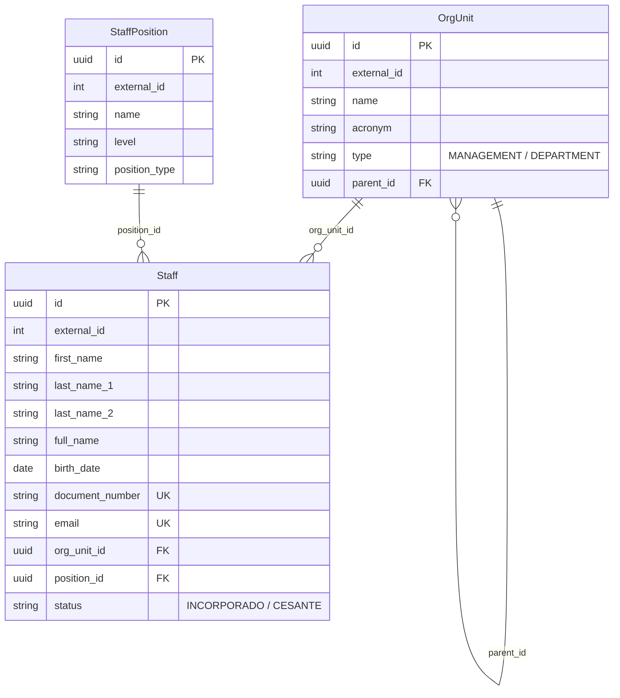

# Core Module Guide - Global Staff & Org Structure

Este documento describe la arquitectura, el modelo de datos y la implementación del módulo **Core** del sistema, encargado de gestionar la estructura organizacional y el personal global.

## 1. Arquitectura Modular

El módulo Core implementa el patrón de **Nested Routing** y **Aplanamiento Estructural** para maximizar la mantenibilidad.

### Estructura de Archivos
```text
app/modules/core/
├── routers.py          # Agregador raíz (Nested Router)
├── org_units/          # Unidades Organizacionales
│   ├── models.py       # Modelo OrgUnit (Jerárquico)
│   ├── repository.py
│   ├── service.py
│   ├── schemas.py
│   └── routers.py      # /core/org-units
├── positions/          # Cargos / Ítems
│   ├── models.py       # Modelo StaffPosition
│   ├── repository.py
│   ├── service.py
│   ├── schemas.py
│   └── routers.py      # /core/positions
└── staff/              # Personal (Funcionarios)
    ├── models.py       # Modelo Staff
    ├── repository.py   # Soporte para Búsqueda Global
    ├── service.py
    ├── schemas.py
    └── routers.py      # /core/staff
```

---

## 2. Diagrama Entidad-Relación (ERD)



---

## 3. Características Avanzadas

### Soporte para PrimeNG DataTables
Todos los submódulos de Core soportan de forma nativa los requerimientos del frontend PrimeNG:
1. **Paginación en Servidor**: Parámetros `offset` y `limit`.
2. **Ordenamiento Dinámico**: Usando `sort_by` y `sort_order` sobre cualquier columna del modelo.
3. **Conteo unificado**: Endpoint `/count` para calcular la paginación global.

### Búsqueda Global (Global Search)
El repositorio de `Staff` incluye un método `search` optimizado con `col().ilike()` para filtrar simultáneamente por:
- Nombre Completo
- Número de Documento (CI)
- Correo Electrónico

---

## 4. Guía para el Desarrollador

### Cómo añadir un nuevo submódulo a Core
1. Crea la carpeta del submódulo bajo `app/modules/core/`.
2. Implementa los componentes estándar (`models`, `repository`, `service`, `schemas`, `routers`).
3. **Importante**: Registra el nuevo router en `app/modules/core/routers.py`:
```python
from app.modules.core.new_module import routers as new_module_router
router.include_router(new_module_router.router)
```

### Convenciones de Naming (PEP8)
Al importar routers como alias en el agregador de Core, utiliza siempre minúsculas para cumplir con los estándares de calidad del proyecto y evitar alertas en el IDE.
- Correcto: `import routers as staff_router`
- Incorrecto: `import routers as StaffRouter`

---

> [!NOTE]
> Este módulo utiliza `TYPE_CHECKING` para resolver referencias circulares entre modelos jerárquicos y relaciones cruzadas, manteniendo la compatibilidad estricta con **MyPy**.
