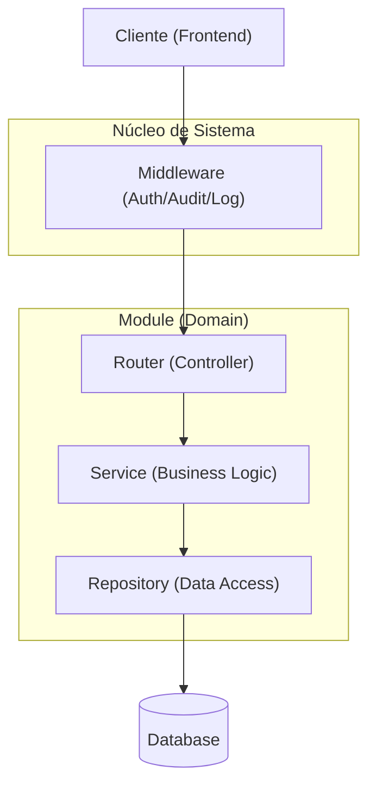

# Patrones de Diseño del Proyecto

Este documento describe la arquitectura y los patrones de diseño implementados en el proyecto `Uyuni-BackEnd`. Sirve como guía para entender cómo están organizados los componentes y cómo deben desarrollarse nuevas funcionalidades.

## Arquitectura General: Layered Architecture (Arquitectura en Capas)
El proyecto sigue una estructura de capas clásica, favoreciendo la separación de preocupaciones (SoC).

### Diagrama de Arquitectura

---

## Patrones de Diseño Implementados

### 1. Repository Pattern (Patrón Repositorio)
Encapsula la lógica necesaria para acceder a las fuentes de datos. Proporciona una interfaz orientada a colecciones para acceder a los datos de dominio, ocultando la complejidad de las consultas SQL.

*   **Ubicación**: `app/core/repository.py`, `app/modules/*/repository.py`.
*   **Uso**:
    *   `BaseRepository[T]`: Una clase genérica que provee métodos estándar (`get`, `get_all`, `create`, `update`, `delete`).
    *   **Motor Genérico de Consultas**: El repositorio base gestiona automáticamente la paginación, el ordenamiento y la búsqueda global polimórfica.
*   **Beneficio**: Centraliza las consultas, evita código SQL/ORM repetido y facilita enormemente el mantenimiento.

### 2. Service Layer Pattern (Patrón Capa de Servicio)
Define el límite de la aplicación y encapsula la lógica de negocio del dominio. Controla las transacciones y coordina las respuestas.

*   **Ubicación**: `app/modules/*/service.py`.
*   **Uso**:
    *   Contiene todas las reglas de negocio y orquesta llamadas a repositorios.
    *   Es la "única fuente de verdad" para las reglas de negocio.
*   **Beneficio**: Mantiene los controladores delgados y la lógica de negocio reutilizable.

### 3. Dependency Injection (Inyección de Dependencias - DI)
Es una técnica donde un objeto recibe otros objetos de los cuales depende.

*   **Ubicación**: En todos los `routers.py` y constructores de servicios.
*   **Uso**: Utilizamos `Depends(...)` nativo de FastAPI.
*   **Beneficio**: Invierte el control (`IoC`), facilitando el testing con Mocks.

### 4. Specification Pattern / Predicate Injection
Este patrón permite desacoplar los requisitos de negocio (filtros) de la tecnología de acceso a datos.

*   **Ubicación**: Implementado vía el parámetro `extra_filters` en el repositorio y configurado en los `Service`.
*   **Uso**:
    *   El **Servicio** define "qué" datos quiere inyectando predicados de SQLModel (ej: `[OrgUnit.type == "MANAGEMENT"]`).
    *   El **Repositorio** se encarga del "cómo" (ejecutar la consulta, paginar y aplicar el `search`).
*   **Beneficio**: Evita crear decenas de métodos en el repositorio para cada filtro diferente. Permite crear "Vistas" de datos complejas desde el servicio manteniendo el repositorio genérico y profesional.

### 5. Data Transfer Object (DTO)
Utilizamos **Pydantic Models** como DTOs para transportar datos entre capas.

*   **Ubicación**: `app/modules/*/schemas.py`.
*   **Beneficio**: Desacopla la estructura interna de la base de datos de la API pública.

### 6. Middleware Pattern
Patrón de cadena de responsabilidad para procesar peticiones HTTP (Auditoría, Seguridad, Logs).

---

## Guía para Nuevos Desarrolladores
(Consultar `DEVELOPER_GUIDE.md` para el paso a paso de implementación).

