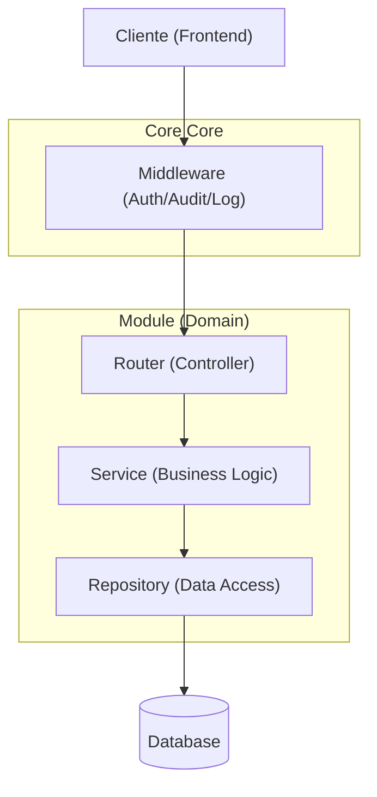
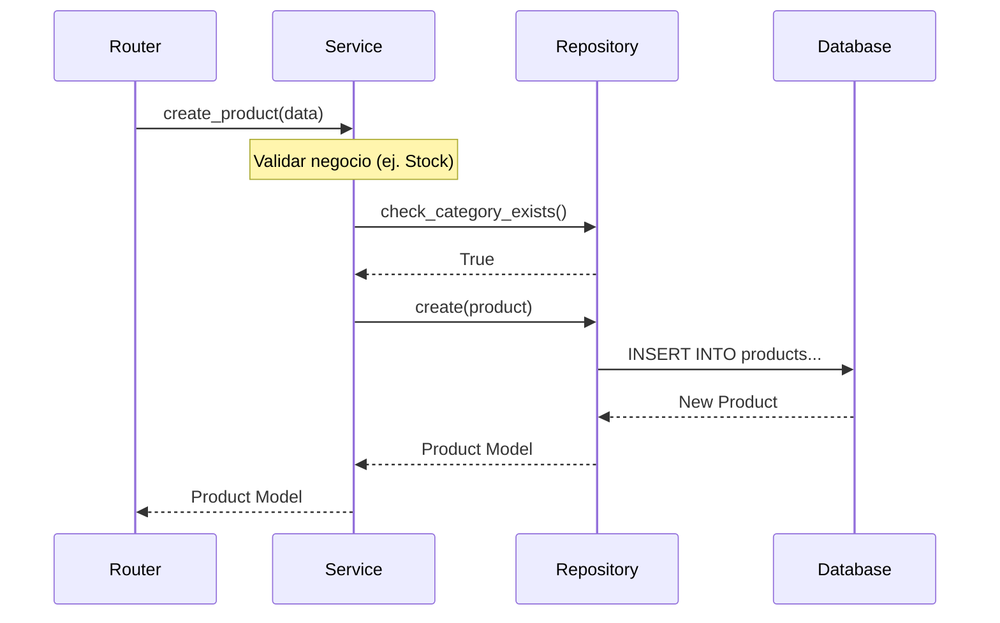

# Patrones de Diseño del Proyecto

Este documento describe la arquitectura y los patrones de diseño implementados en el proyecto `fastapi-product`. Sirve como guía para entender cómo están organizados los componentes y cómo deben desarrollarse nuevas funcionalidades.

## Arquitectura General: Layered Architecture (Arquitectura en Capas)
El proyecto sigue una estructura de capas clásica, favoreciendo la separación de preocupaciones (SoC).

### Diagrama de Arquitectura

---

## Patrones de Diseño Implementados

### 1. Repository Pattern (Patrón Repositorio)
Encapsula la lógica necesaria para acceder a las fuentes de datos. Proporciona una interfaz orientada a colecciones para acceder a los datos de dominio, ocultando la complejidad de las consultas SQL.

*   **Ubicación**: `app/core/repository.py`, `app/modules/*/repository.py`.
*   **Uso**:
    *   `BaseRepository[T]`: Una clase genérica que provee métodos estándar (`get`, `get_all`, `create`, `update`, `delete`).
    *   `ProductRepository`: Extiende `BaseRepository/Product` para agregar consultas complejas específicas (ej. `get_by_id_with_relations` usando `selectinload`).
*   **Beneficio**: Centraliza las consultas, evita código SQL/ORM repetido en los servicios y facilita el testing.

### 2. Service Layer Pattern (Patrón Capa de Servicio)
Define el límite de la aplicación y encapsula la lógica de negocio del dominio. Controla las transacciones y coordina las respuestas.

*   **Ubicación**: `app/modules/*/service.py` (ej. `AuthService`, `ProductService`).
*   **Uso**:
    *   Contiene todas las reglas de negocio, validaciones complejas, hash de contraseñas, etc.
    *   Orquesta llamadas a uno o varios repositorios.
    *   Es agnóstico al framework web (FastAPI); teóricamente podría ser usado por una CLI o un script.
*   **Beneficio**: Mantiene los controladores ("routers") delgados ("Thin Controllers"), delegando toda la complejidad al servicio.

### 3. Dependency Injection (Inyección de Dependencias - DI)
Es una técnica donde un objeto recibe otros objetos de los cuales depende, en lugar de crearlos internamente.

*   **Ubicación**: En todos los `routers.py` y constructores de servicios.
*   **Uso**:
    *   Utilizamos el sistema `Depends(...)` nativo de FastAPI.
    *   `get_db` inyecta la sesión de base de datos.
    *   `get_auth_service` inyecta el repositorio y la sesión en el servicio.
*   **Beneficio**: Invierte el control (`IoC`), permitiendo cambiar implementaciones fácilmente y simplificando drásticamente las pruebas unitarias mediante Mocks.

### 4. Data Transfer Object (DTO)
Son objetos que transportan datos entre procesos. En este proyecto, utilizamos **Pydantic Models** como DTOs.

*   **Ubicación**: `app/modules/*/schemas.py`.
*   **Uso**:
    *   `UserCreate`: Define qué datos se aceptan para crear un usuario (DTO de entrada).
    *   `UserResponse`: Define qué datos se devuelven al cliente (DTO de salida), ocultando campos sensibles como `password_hash`.
*   **Beneficio**: Desacopla la estructura interna de la base de datos de la API pública. Provee validación de datos automática y documentación (OpenAPI).

### 5. Middleware Pattern
Es un patrón de cadena de responsabilidad donde varios componentes procesan una petición HTTP.

*   **Ubicación**: `app/main.py` y `app/core/audit`.
*   **Uso**:
    *   `AuditMiddleware`: Intercepta peticiones para auditoría.
    *   `CORSMiddleware`: Gestiona cabeceras de seguridad.
    *   `logging_middleware`: Genera Request IDs únicos para trazabilidad.

---

## Guía para Nuevos Desarrolladores
Para agregar una nueva funcionalidad (ej. "Orders"), sigue este flujo:

1.  **Model**: Crea `modules/orders/models.py` (Entidad de BD).
2.  **Schema**: Crea `modules/orders/schemas.py` (DTOs de entrada/salida).
3.  **Repository**:
    *   Crea `OrderRepository` heredando de `BaseRepository`.
    *   Si solo necesitas CRUD básico, no agregues nada más.
4.  **Service**:
    *   Crea `OrderService`.
    *   Inyecta `OrderRepository` en el `__init__`.
    *   Implementa la lógica de negocio.
5.  **Router**:
    *   Define los endpoints.
    *   Inyecta `OrderService` usando `Depends`.
    *   Llama a los métodos del servicio.

Este diseño garantiza que tu código será coherente con el resto del proyecto.
