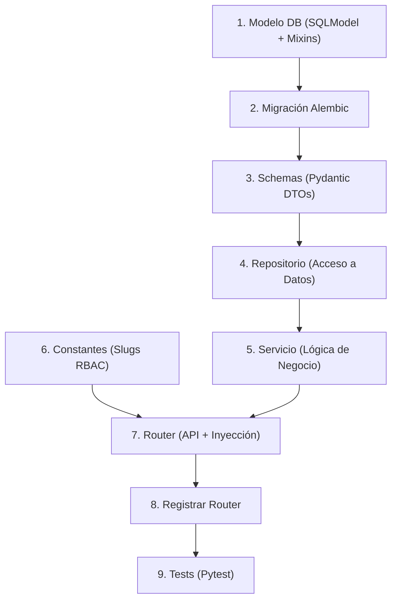

# Manual del Desarrollador: Creación de Módulos (v3.0)

Esta guía describe el flujo de trabajo estándar para añadir una nueva funcionalidad (Módulo) al sistema **FastAPI Enterprise**, asegurando el cumplimiento de los estándares de Calidad, Seguridad y Arquitectura.

## Flujo de Trabajo (Receta Paso a Paso)



> **Nota**: Para los fundamentos teóricos, consulta:
> *   **[Guía de Arquitectura / Patrones](DESIGN_PATTERNS_GUIDE.md)**
> *   **[Guía de Auditoría](AUDIT_GUIDE.md)**
> *   **[Guía de Calidad](QUALITY_GUIDE.md)**

---

### 1. Definición del Modelo (Base de Datos)

El primer paso es definir la entidad.
**Reglas de Oro**:
1.  Heredar de **`BaseModel`** (para tener ID UUIDv7) y `AuditMixin` (para auditoría).
2.  Nombre de tabla en **plural** (`__tablename__ = "products"`).

**Archivo**: `app/modules/{dominio}/{submodulo}/models.py`

```python
from sqlmodel import Field
from app.models.base_model import BaseModel
from app.models.mixins import AuditMixin

# BaseModel ya incluye: id (UUIDv7)
# AuditMixin agrega: created_at, updated_at, created_by_id, updated_by_id
class NuevoRecurso(BaseModel, AuditMixin, table=True):
    __tablename__ = "nuevos_recursos"

    nombre: str = Field(index=True)
    activo: bool = Field(default=True)
```

> **Magia de la Base**: 
> *   **IDs**: Al heredar de `BaseModel`, el `id` (UUIDv7) se genera solo.
> *   **Fechas**: `AuditMixin` gestiona `created_at` y `updated_at` automáticamente (vía factories y eventos de SQL).
> *   **Usuarios**: Los **Hooks** del sistema inyectan `created_by_id` y `updated_by_id` detectando al usuario autenticado.
>
> **Resultado**: El desarrollador no necesita tocar estos campos manualmente jamás.

---

### 2. Generar Migración (Alembic)

Registra tu modelo en `alembic/env.py` (importándolo con su ruta absoluta) y genera el script.

```bash
# 1. Crear la migración
alembic revision --autogenerate -m "add_nuevo_recurso"

# 2. Aplicar cambios a la BD
alembic upgrade head
```

---

### 3. Crear Schemas (DTOs)

**Archivo**: `app/modules/{dominio}/{submodulo}/schemas.py`

```python
import uuid
from pydantic import BaseModel

class NuevoRecursoBase(BaseModel):
    nombre: str
    activo: bool = True

class NuevoRecursoCreate(NuevoRecursoBase):
    pass 

class NuevoRecursoRead(NuevoRecursoBase):
    id: uuid.UUID
```

---

### 4. Crear Repositorio

Capa de acceso a datos. Hereda de `BaseRepository`.
**Regla**: Aquí van las consultas SQL (`select`, `where`).

**Archivo**: `app/modules/{dominio}/{submodulo}/repository.py`

```python
from app.core.repository import BaseRepository
from .models import NuevoRecurso

class NuevoRecursoRepository(BaseRepository[NuevoRecurso]):
    def __init__(self, session):
        super().__init__(session, NuevoRecurso)
```

---

### 5. Crear Servicio (Lógica de Negocio)

**Archivo**: `app/modules/{dominio}/{submodulo}/service.py`

```python
from .repository import NuevoRecursoRepository
from .schemas import NuevoRecursoCreate
from .models import NuevoRecurso

class NuevoRecursoService:
    def __init__(self, repository: NuevoRecursoRepository):
        self.repository = repository

    def crear(self, data: NuevoRecursoCreate):
        nuevo_db = NuevoRecurso.model_validate(data)
        return self.repository.create(nuevo_db)
```

---

### 6. Definir Constantes de Identidad (RBAC)

**Archivo**: `app/modules/{dominio}/constants.py`

Cada dominio debe centralizar sus Slugs de módulos en un archivo de constantes local para evitar conflictos entre equipos paralelos.

```python
class MiDominioModuleSlug:
    NUEVO_RECURSO = "mi_nuevo_recurso"
```

---

### 7. Crear Router (API)

**Archivo**: `app/modules/{dominio}/{submodulo}/routers.py`

```python
from fastapi import APIRouter, Depends, status
from app.core.db import get_session
from app.auth.permissions import PermissionAction, PermissionChecker
from app.auth.schemas import UserModulePermission
from ..constants import MiDominioModuleSlug # Importar constantes del dominio

from .service import NuevoRecursoService
from .repository import NuevoRecursoRepository
from .schemas import NuevoRecursoCreate, NuevoRecursoRead

router = APIRouter()

def get_service(session = Depends(get_session)):
    repo = NuevoRecursoRepository(session)
    return NuevoRecursoService(repo)

@router.post("/", response_model=NuevoRecursoRead)
def create_item(
    data: NuevoRecursoCreate, 
    service: NuevoRecursoService = Depends(get_service),
    _: UserModulePermission = Depends(
        PermissionChecker(
            module_slug=MiDominioModuleSlug.NUEVO_RECURSO, 
            required_permission=PermissionAction.CREATE
        )
    ),
):
    return service.crear(data)
```

---

### 8. Registrar el Router

**Archivo**: `app/modules/{dominio}/routers.py`

Añade el router del submódulo al enrutador agregador del dominio.

```python
from .submodulo import routers as submodulo_routers

router.include_router(submodulo_routers.router)
```

---

### 9. Testing Automatizado

Crea un test de integración. Usa `TestClient`.

**Archivo**: `tests/modules/{dominio}/test_{submodulo}_routers.py`

```python
def test_create_nuevo_recurso_ok(client, superuser_token_headers):
    data = {"nombre": "Test 1"}
    response = client.post("/api/mi-ruta/", json=data, headers=superuser_token_headers)
    
    assert response.status_code == 201
    content = response.json()
    assert content["nombre"] == "Test 1"
```

---

### Checklist de Calidad Final

Antes de `git push`, ejecuta:

```bash
# 1. Formatear y Linting
ruff check --fix .
ruff format .

# 2. Tipado Estático
mypy .

# 3. Tests
pytest
```

