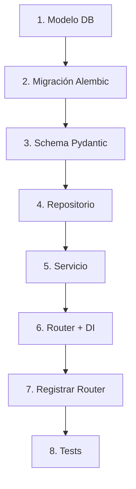

# Manual del Desarrollador: Creación de Módulos

Esta guía describe el flujo de trabajo estándar para añadir una nueva funcionalidad (Módulo) al sistema, asegurando que se cumplan todos los estándares de calidad y arquitectura.

## Flujo de Trabajo (Receta Paso a Paso)



> **Nota**: Para entender los fundamentos teóricos detrás de estos pasos, consulta la **[Guía de Patrones de Diseño](DESIGN_PATTERNS_GUIDE.md)** y la **[Guía SOLID](SOLID_GUIDE.md)**.

### 1. Definición del Modelo (Base de Datos)
El primer paso es definir la entidad en la base de datos.
**Archivo**: `app/modules/{nombre_modulo}/models.py`

```python
from sqlmodel import Field, SQLModel

# Heredar de SQLModel y configurar table=True
class NuevoRecurso(SQLModel, table=True):
    id: int | None = Field(default=None, primary_key=True)
    nombre: str
    activo: bool = True
```

### 2. Generar Migración (Alembic)
Una vez creado el modelo, debemos decirle a la base de datos que cree la tabla.

```bash
# 1. Crear la migración
alembic revision --autogenerate -m "add_nuevo_recurso"

# 2. Aplicar cambios a la BD
alembic upgrade head
```

### 3. Crear Schemas (DTOs)
Define qué datos entran y salen de tu API.
**Archivo**: `app/modules/{nombre_modulo}/schemas.py`

```python
from pydantic import BaseModel

class NuevoRecursoCreate(BaseModel):
    nombre: str

class NuevoRecursoRead(BaseModel):
    id: int
    nombre: str
```

### 4. Crear Repositorio
Capa de acceso a datos. Hereda de `BaseRepository`.
**Archivo**: `app/modules/{nombre_modulo}/repository.py`

```python
from app.core.repository import BaseRepository
from .models import NuevoRecurso

class NuevoRecursoRepository(BaseRepository[NuevoRecurso]):
    pass 
```

### 5. Crear Servicio (Lógica de Negocio)
Aquí va la validación y reglas de negocio. No uses `HTTPException` aquí de ser posible (usa excepciones propias).
**Archivo**: `app/modules/{nombre_modulo}/service.py`

```python
from .repository import NuevoRecursoRepository
from .schemas import NuevoRecursoCreate

class NuevoRecursoService:
    def __init__(self, repository: NuevoRecursoRepository):
        self.repository = repository

    def crear(self, data: NuevoRecursoCreate):
        # Validaciones extra...
        return self.repository.create(data)
```

### 6. Crear Router (API)
Expone los endpoints y conecta todo usando Inyección de Dependencias.
**Archivo**: `app/modules/{nombre_modulo}/routers.py`

```python
from fastapi import APIRouter, Depends
from app.core.db import get_session
from .service import NuevoRecursoService
from .repository import NuevoRecursoRepository

router = APIRouter()

# Factoría de dependencias
def get_service(session = Depends(get_session)):
    repo = NuevoRecursoRepository(session)
    return NuevoRecursoService(repo)

@router.post("/", status_code=201)
def create_item(
    data: NuevoRecursoCreate, 
    service: NuevoRecursoService = Depends(get_service)
):
    return service.crear(data)
```

### 7. Registrar el Módulo
Añade tu nuevo router al archivo principal de rutas.
**Archivo**: `app/core/routers.py`

```python
from app.modules.nombre_modulo.routers import router as nuevo_router
...
api_router.include_router(nuevo_router, prefix="/nuevos", tags=["Nuevos"])
```

### 8. Testing Automatizado
Crea un test de integración para verificar que tu endpoint funciona.
**Archivo**: `tests/modules/{nombre_modulo}/test_routers.py`

```python
def test_create_nuevo_recurso(client):
    response = client.post("/api/nuevos/", json={"nombre": "Test"})
    assert response.status_code == 201
    assert response.json()["nombre"] == "Test"
```

Ejecuta los tests:
```bash
pytest
```

### 9. Calidad de Código (Final Check)
Antes de subir tus cambios (git push), asegura que todo esté limpio.

```bash
# 1. Formatear código (arregla espacios, imports)
ruff format .

# 2. Chequear errores lógicos
ruff check . --fix

# 3. Verificar tipos (opcional pero recomendado)
mypy .
```

---
**¡Felicidades!** Has completado el ciclo de desarrollo de un módulo Enterprise. 🚀
