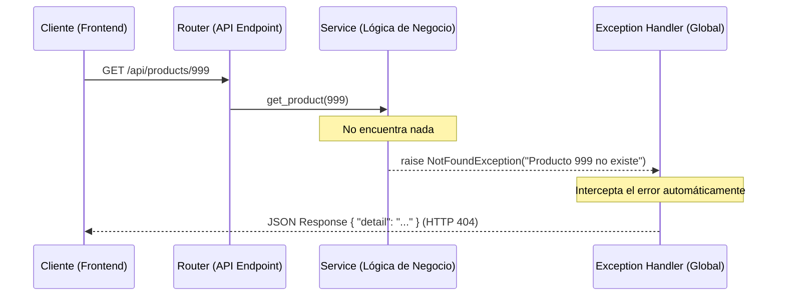

# 🛠️ Guía Maestra de Manejo de Excepciones

Esta guía es el recurso principal para entender cómo gestionamos los errores en este ecosistema. Si eres un desarrollador nuevo (Junior o Senior), lee esto detenidamente.

---

## 1. 💡 La Filosofía: "¿Por qué no usar HTTPException?"

Para un desarrollador Junior, lo más fácil es lanzar un `HTTPException(404, "No encontrado")`. Sin embargo, en arquitectura empresarial seguimos la **Separación de Concernimientos (Separation of Concerns)**.

### ¿Por qué lo hacemos así?
1.  **Desacoplamiento Total**: Tu lógica de negocio (en `service.py`) no debería saber nada sobre "HTTP" o "JSON". Debería preocuparse solo por las reglas del negocio.
2.  **Consistencia**: Al centralizar los errores, garantizamos que el frontend siempre reciba la misma estructura de respuesta, sin sorpresas.
3.  **Clean Code**: Evitamos llenar los Routers o Servicios de bloques `try-except` repetitivos. El error simplemente "fluye" hacia arriba hasta que alguien (el Handler) lo captura.

---

## 2. 🗺️ Mapa de Archivos Relacionados

Para que no te pierdas, aquí están los archivos que "hacen la magia":

```text
app/
├── core/
│   ├── exceptions.py   <-- 1. Aquí se DEFINEN las clases de excepción.
│   ├── handlers.py     <-- 2. Aquí se decide qué RESPUESTA (JSON) dar.
│   └── routers.py      <-- (Opcional) Routers base.
├── main.py             <-- 3. Aquí se REGISTRA la conexión entre Exception -> Handler.
└── modules/
    └── [tu_modulo]/
        └── service.py  <-- 4. Aquí es donde tú LANZAS (raise) el error.
```

---

## 3. 🔄 Flujo de Vida de un Error

Imagina que buscas un producto que no existe. Así viaja el error:



---

## 4. 📚 Catálogo de Excepciones (¿Cuál usar?)

| Clase | Código | Cuándo usarla (Ejemplo) |
| :--- | :--- | :--- |
| `NotFoundException` | 404 | "El usuario con ID 5 no existe en la base de datos". |
| `BadRequestException` | 400 | "No puedes comprar stock negativo" o "Email ya está en uso". |
| `UnauthorizedException` | 401 | "Token expirado o inválido". |
| `ForbiddenException` | 403 | "No tienes permiso para borrar este registro" o "Cuenta bloqueada". |
| `InternalServerErrorException`| 500 | "Fallo crítico conectando con el servicio de correos externo". |

---

## 5. 👨‍🍳 La Receta: "Quiero agregar una nueva excepción"

Si necesitas un error nuevo (ej. `ExternalServiceException`), sigue estos 3 pasos:

### Paso 1: Definir la Clase
Añádela en [exceptions.py](file:///opt/uyuni/uyuni-backend-py/app/core/exceptions.py).
```python
class ExternalServiceException(CustomException):
    """Error cuando un API de terceros falla"""
    pass
```

### Paso 2: Definir el Handler
Dile a FastAPI cómo responder en [handlers.py](file:///opt/uyuni/uyuni-backend-py/app/core/handlers.py).
```python
async def external_service_handler(request: Request, exc: ExternalServiceException):
    return JSONResponse(
        status_code=502, # Bad Gateway
        content={"detail": exc.detail, "source": "ThirdPartyService"},
    )
```

### Paso 3: Registrar en Main
"Enchufa" todo en [main.py](file:///opt/uyuni/uyuni-backend-py/app/main.py).
```python
from app.core.exceptions import ExternalServiceException
from app.core.handlers import external_service_handler

app.add_exception_handler(ExternalServiceException, external_service_handler)
```

---

## 6. ⚖️ Senior vs Junior (Mejores Prácticas)

| Situación | Junior (Lo que NO hay que hacer) ❌ | Senior (Lo que SÍ hay que hacer) ✅ |
| :--- | :--- | :--- |
| **Control de flujo** | Usar excepciones para "saltar" entre funciones. | Usar excepciones solo para situaciones *excepcionales*. |
| **Mensajes** | `raise BadRequestException("Error")` | `raise BadRequestException(f"El SKU '{sku}' ya existe")` |
| **En Routers** | Llenar el router con `try...except`. | Dejar que el error burbujee hasta el Handler central. |
| **Tipado** | No heredar de `CustomException`. | Heredar siempre para mantener la estructura de `detail` y `headers`. |

---

## 7. 🔍 Observabilidad: El Poder del Request ID

Cuando tienes cientos de usuarios, los logs se mezclan. Por eso, cada petición recibe un **Request ID** (un código único como `48f2fa79...`) que sirve como el "hilo conductor" de todo lo que pasa.

### ¿Cómo funciona la trazabilidad?

Imagina que un usuario intenta loguearse con datos incorrectos. Tu consola te contará la historia completa usando el mismo ID para conectar los eventos:

```text
# 1. El Exception Handler captura el error y registra el detalle
2026-01-27... [warning] unauthorized_access  detail=Incorrect username or password  request_id=48f2fa79...

# 2. El Middleware registra que la petición terminó
2026-01-27... [info] request_completed        method=POST path=/api/auth/login       request_id=48f2fa79... status_code=401
```

### ¿Dónde encuentro los logs?
*   **En Desarrollo**: Directamente en tu **terminal** (donde corre `fastapi dev`). Los errores suelen aparecer resaltados en amarillo o rojo.
*   **En Producción**: Se emiten como **JSON** a la salida estándar (`stdout`), permitiendo que herramientas como Datadog, CloudWatch o ELK los procesen automáticamente.

### Consejos de Análisis para Desarrolladores

1.  **Copia el ID**: Si un usuario reporta un error o ves un fallo en el frontend, busca el `X-Request-ID` en las cabeceras de la respuesta (Network tab del navegador).
2.  **Filtra en la Terminal**:
    ```bash
    # Si guardas logs en un archivo, usa grep para ver solo esa petición
    grep "48f2fa79-ca98-451d..." app.log
    ```
3.  **Logs Manuales**: Si necesitas añadir tus propios logs en el `service.py`, usa `structlog`:
    ```python
    import structlog
    logger = structlog.get_logger()

    def mi_funcion():
        # Este log incluirá el request_id automáticamente!
        logger.info("Procesando pago", monto=100)
    ```

> [!IMPORTANT]
> Gracias a `structlog.contextvars`, **no necesitas pasar el request_id como argumento** a tus funciones. El sistema lo "inyecta" mágicamente en cada log que hagas dentro del ciclo de vida de la petición.

---

## 8. ✅ Checklist de Integración

- [ ] ¿Mi excepción hereda de `CustomException`?
- [ ] ¿He evitado usar `HTTPException` en el Service?
- [ ] ¿El mensaje de error le sirve al usuario de la API?
- [ ] (Si es nueva) ¿Está registrada en `main.py`?
- [ ] (Si es técnica) ¿He usado el `logger` antes de lanzarla?
