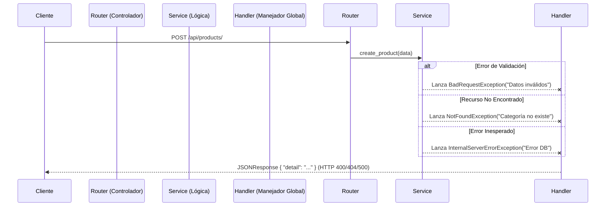

# Guía de Manejo de Excepciones

Esta guía detalla cómo funciona el sistema centralizado de manejo de errores en el proyecto y cómo debes utilizarlo al desarrollar nuevos módulos.

---

## 1. Filosofía
En este proyecto, **NO** devolvemos directamente excepciones HTTP de FastAPI (`HTTPException`) desde la capa de **Servicio** o **Dominio**.
En su lugar, utilizamos **Excepciones Personalizadas** (`CustomException`) que son agnósticas al framework web.

**¿Por qué?**
*   **Desacoplamiento**: La lógica de negocio no debe saber que está corriendo sobre HTTP.
*   **Consistencia**: Aseguramos que todos los errores tengan el mismo formato de respuesta JSON.
*   **Limpieza**: Los controladores (Routers) quedan limpios de bloques try-catch repetitivos.

---

## 2. Arquitectura del Flujo de Errores

El siguiente diagrama muestra cómo fluye una excepción desde que se lanza en el Servicio hasta que llega al Cliente.



---

## 3. Tipos de Excepciones Disponibles

Todas las excepciones heredan de `app.core.exceptions.CustomException`.

| Excepción | Código HTTP | Cuándo usarla |
| :--- | :--- | :--- |
| **`NotFoundException`** | `404 Not Found` | Cuando buscas un registro por ID y no existe. |
| **`BadRequestException`** | `400 Bad Request` | Cuando la validación de negocio falla (ej. stock negativo, fecha inválida). |
| **`InternalServerErrorException`** | `500 Internal Server Error` | Para errores críticos inesperados (ej. fallo de conexión a BD ajeno a nosotros). |

---

## 4. ¿Cómo implementar en tu Módulo?

### Paso 1: Importar las excepciones
En tu archivo `service.py`:

```python
from app.core.exceptions import NotFoundException, BadRequestException, InternalServerErrorException
```

### Paso 2: Lanzar la excepción (Raise)
**NUNCA** captures la excepción para silenciarla. **Captúrala solo para relanzarla** con más contexto o lánzala directamente si se cumple una regla de negocio.

#### Ejemplo A: Validación de Negocio
```python
# app/modules/products/service.py

def create_product(self, item_data: ProductCreate):
    # Validar si la categoría existe
    if not self.repository.check_category_exists(item_data.category_id):
        # ✅ CORRECTO: Lanzar excepción de dominio
        raise NotFoundException(
            detail=f"La categoría {item_data.category_id} no existe"
        )
    
    # ... crear producto
```

#### Ejemplo B: Manejo de Errores de BD
```python
# app/modules/products/service.py

def create_product(self, item_data):
    try:
        return self.repository.create(item_db)
    except DatabaseError as e:
        # ✅ CORRECTO: Envolver error técnico en error de dominio
        # Loguear el error real (e) usando logger antes de lanzar
        logger.error(f"Error creando producto: {e}") 
        raise InternalServerErrorException(
            detail="Error interno al crear el producto, intente nuevamente."
        )
```

### ❌ Lo que NO debes hacer

```python
# ⛔ INCORRECTO: No uses HTTPException directamente en el Service
from fastapi import HTTPException

def get_product(self, id):
    if not product:
        raise HTTPException(status_code=404, detail="No encontrado") # ❌ Mal
```

---

## 5. ¿Cómo funciona "bajo el capó"?

El archivo `app/main.py` conecta las excepciones con los handlers definidos en `app/core/handlers.py`.

```python
# app/main.py
app.add_exception_handler(NotFoundException, not_found_exception_handler)
app.add_exception_handler(BadRequestException, bad_request_exception_handler)
# ...
```

Esto intercepta cualquier `NotFoundException` que "suba" desde tu código y la transforma automáticamente en esto:

```json
// Respuesta HTTP 404
{
    "detail": "La categoría 5 no existe"
}
```

---

## 6. Checklist para Onboarding

- [ ] Revisa `app/core/exceptions.py` para ver la lista completa de errores.
- [ ] Usa siempre excepciones personalizadas en `service.py`.
- [ ] No uses `try-except` en los `routers.py` a menos que sea estrictamente necesario. Deja que el error "burbujee" hasta el handler global.
