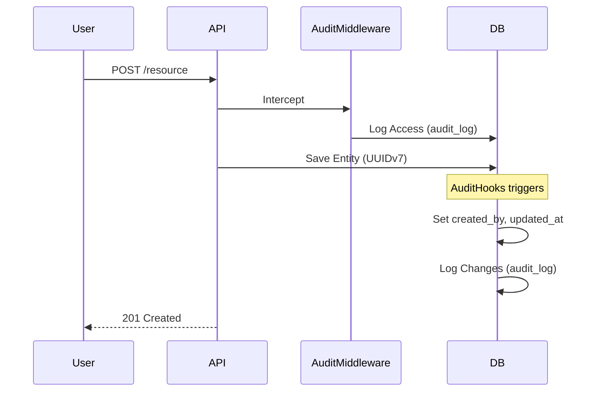

# Análisis de Arquitectura y Calidad de Código

## Resumen Ejecutivo
El proyecto `uyuni-backend-py` demuestra un alto nivel de madurez técnica, adhiriéndose consistentemente a los principios de **Clean Architecture** y **Clean Code**. La estructura modular ("Modular Monolith"), el uso de `SQLModel` y `Pydantic` para la validación tipada, y la estricta separación de capas (Router -> Service -> Repository) posicionan al código como "Enterprise-Grade".

---

## 🏗️ Arquitectura del Sistema

El sistema sigue una arquitectura de **Monolito Modular** con capas claramente definidas.

```mermaid
graph TD
    Client[Cliente HTTP] -->|Request| Middleware[Middleware Layer\n(Audit, Auth, CORS)]
    Middleware -->|Request| Router[Router Layer\n(Controllers)]
    
    subgraph "Application Core"
        Router -->|DTOs| Service[Service Layer\n(Business Logic)]
        Service -->|Entities| Repository[Repository Layer\n(Data Access)]
    end
    
    subgraph "Infrastructure"
        Repository -->|SQLModel| DB[(PostgreSQL\nUUIDv7)]
    end

    style Component fill:#f9f,stroke:#333
```

## Evaluación de Clean Architecture

### 1. Estructura Modular y Separación de Responsabilidades (SoC)
El proyecto sigue una arquitectura **Domain-Driven Design (DDD) Lite**, donde cada módulo (`app/modules/`) encapsula su propio dominio.

*   **Capa de Presentación (Routers)**: `routers.py` maneja exclusivamente la lógica HTTP (status codes, inyección de dependencias). Delega toda la lógica de negocio a los Servicios.
    *   *Estado*: ✅ **Excelente**. No hay "Fat Controllers".
*   **Capa de Aplicación (Services)**: `service.py` contiene los casos de uso (Create Task, Login User).
    *   *Estado*: ✅ **Muy Bien**. `TaskService` actúa como orquestador. `AuthService` es robusto y ahora desacoplado de HTTP.
*   **Capa de Dominio/Persistencia (Repositories & Models)**:
    *   `models.py` (Entidades): Uso de `BaseModel` (con UUIDv7) y `AuditMixin` para estandarizar entidades.
    *   `repository.py` (Acceso a Datos): Patrón Repository genérico (`BaseRepository`) que desacopla la lógica de negocio de las consultas SQL específicas.
    *   *Estado*: ✅ **Excelente abstracción**.

### 2. Inyección de Dependencias (DI)
El sistema aprovecha al máximo el sistema de DI de FastAPI.
*   Uso de `get_session` y `SessionDep`.
*   Inyección de `Service` en `Router`, y `Repository` en `Service`.
*   Esto facilita enormemente el testing y desacopla componentes.

---

## Evaluación de Clean Code y S.O.L.I.D.

### Puntos Fuertes
1.  **Tipado Estático Riguroso**: Uso extensivo de Type Hints (`uuid.UUID`, `SessionDep`, `list[Task]`). Validado por `mypy` sin errores.
2.  **Naming Conventions**: Nombres descriptivos y consistentes (`get_by_id_with_relations`, `login_for_access_token`). Uso de snake_case y PascalCase estándar.
3.  **DRY (Don't Repeat Yourself)**:
    *   `AuditMixin` evita repetir campos de auditoría.
    *   `BaseRepository` evita repetir código CRUD básico.
    *   Manejadores de excepciones centralizados (`app/core/handlers.py`).
4.  **Modernidad**: Uso de `UUIDv7` (via `uuid6`) para rendimiento y modernidad en Bases de Datos.

### Diagrama de Flujo de Auditoría (AuditMixin)



---

## Áreas de Mejora (Refactorización Potencial)

1.  **Independencia del Framework en Servicios (Pureza)**:
    *   *Estado*: ✅ **Resuelto**. Se refactorizó `AuthService` y `PermissionChecker` para usar Excepciones de Dominio (`ForbiddenException`, `UnauthorizedException`) en lugar de `HTTPException`.
    *   *Beneficio*: Desacoplamiento total entre Lógica de Negocio y HTTP.

2.  **Single Responsibility Principle (SRP) en Auth**:
    *   `AuthService` gestiona Logins, Tokens, Logout (Autenticación) Y creación de usuarios (Gestión de Identidad).
    *   *Sugerencia*: A futuro, separar `UserService` (CRUD de usuarios) de `AuthService` (Lógica de sesión/tokens).

---

## Conclusión
El proyecto cumple con los estándares industriales modernos para backend en Python. La arquitectura es escalable, mantenible y testeable.

**Calificación: A**
*(Código refactorizado para máxima pureza arquitectónica y uso de estándares modernos como UUIDv7).*
