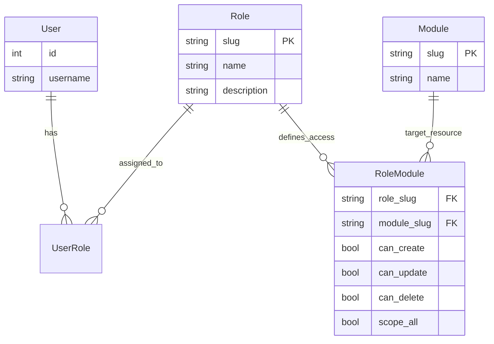

# Guía del Sistema de Control de Acceso Basado en Roles (RBAC)

Este documento explica el sistema RBAC implementado en el proyecto y proporciona recetas para que los desarrolladores aseguren sus módulos.

## Resumen de la Arquitectura

El sistema permite un control de permisos granular a nivel de **Módulo**. Utiliza **Slugs** (identificadores de texto únicos) para definir relaciones portables entre Roles y Módulos.

### Componentes Clave en RBAC
*   **Usuarios**: Pueden tener múltiples **Roles**.
*   **Roles**: Colecciones de permisos. Se identifican por un `slug` (ej: `admin`, `ventas`).
*   **Módulos**: Representan áreas funcionales (ej: `Staff`, `Assets`). Identificados por `slug`.
*   **RoleModule**: Tabla de enlace que define:
    *   **Acciones**: `can_create`, `can_update`, `can_delete`.
    *   **Alcance (Scope)**: `scope_all`.
        *   `True`: El usuario ve **todos** los registros.
        *   `False`: El usuario ve **solo sus propios** registros.
    *   **Lectura**: Es implícita si existe el registro activo.

### Diagrama Entidad-Relación (Simplificado)


### Lógica de Agregación y Personificación
El sistema opera en dos modos:

1.  **Agregación (Por Defecto)**: Si el usuario no especifica un rol, los permisos son **aditivos**. Se suman todos los permisos de todos los roles activos del usuario.
2.  **Personificación (Estricto)**: Si el frontend envía el header `X-Active-Role: <slug>`, el sistema ignora los otros roles y calcula permisos **exclusivamente** basados en el rol solicitado.
    *   Si el usuario no tiene asignado ese rol -> `403 Forbidden`.

**Superusuarios** (`is_superuser=True`) evaden todas las comprobaciones y tienen acceso total (`scope_all=True`).

---

## 👩‍💻 Recetas para Desarrolladores

### 1. Protegiendo un Nuevo Endpoint
Usa la dependencia `PermissionChecker` junto con las constantes de dominio para evitar errores de escritura.

```python
from fastapi import APIRouter, Depends
from app.auth.permissions import PermissionChecker, PermissionAction
from app.auth.schemas import UserModulePermission
from app.modules.core.constants import CoreModuleSlug # Importar constante

router = APIRouter()

# 1. Lectura (Implícito)
@router.get("/")
async def get_items(
    permissions: UserModulePermission = Depends(
        PermissionChecker(
            module_slug=CoreModuleSlug.STAFF, 
            required_permission=PermissionAction.READ
        )
    ),
):
    # Filtrado por Scope (Privacidad de datos)
    if not permissions.scope_all:
        return {"msg": "Mostrando solo MIS registros"}
    return {"msg": "Mostrando TODOS los registros"}

# 2. Escritura (Requiere permiso explícito)
@router.post("/")
async def create_item(
    _: UserModulePermission = Depends(
        PermissionChecker(
            module_slug=CoreModuleSlug.STAFF, 
            required_permission=PermissionAction.CREATE
        )
    ),
):
    return {"msg": "¡Ítem creado!"}
```

### 2. Registrando un Nuevo Módulo
1.  **Seed Data**: Crea el módulo en la BD (Slug debe coincidir con la constante).
2.  **Naming**: Usa `snake_case` o `kebab-case` para el slug, pero sé consistente con la constante definida en `constants.py`.

### 3. Usando Permisos en el Frontend
El frontend recibe el objeto de permisos y puede:
*   Ocultar botones de "Eliminar" si `!can_delete`.
*   Ocultar filtros de "Ver Todos" si `!scope_all`.

## Referencia de API
*   `GET /me/roles`: Lista roles activos con `slug` y `description`.
*   `GET /me/menu/{role_slug}`: Devuelve el menú jerárquico para un rol específico.

