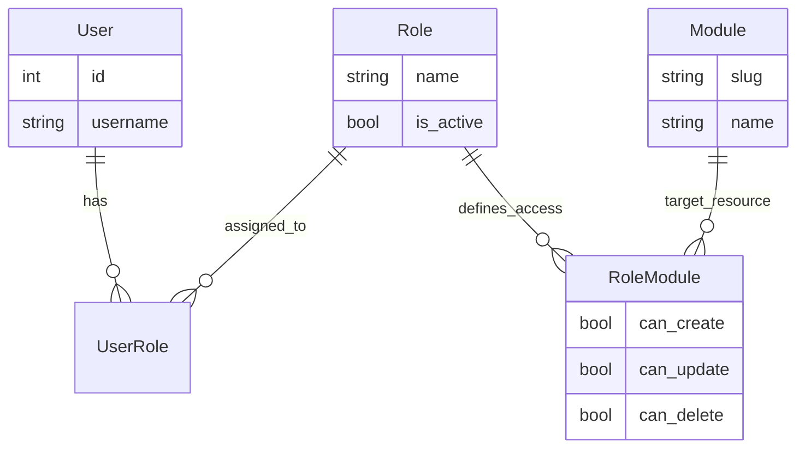

# Guía del Sistema de Control de Acceso Basado en Roles (RBAC)

Este documento explica el sistema RBAC implementado en el proyecto y proporciona recetas para que los desarrolladores aseguren sus módulos.

## Resumen de la Arquitectura

El sistema permite un control de permisos granular a nivel de **Módulo**. Utiliza una "Dependencia de Permisos" que inyecta los permisos del usuario para un módulo específico en el endpoint de la API.

### Componentes Clave en RBAC
*   **Usuarios**: Pueden tener múltiples **Roles**.
*   **Roles**: Colecciones de permisos para múltiples **Módulos**.
*   **Módulos**: Representan áreas funcionales (ej: `Tareas`, `Usuarios`, `Productos`). Identificados por un `slug` único.
*   **Grupos de Módulos**: Categorización para módulos en el menú del frontend.
*   **RoleModule**: La tabla de enlace donde se definen los permisos (`can_create` (crear), `can_update` (actualizar), `can_delete` (eliminar)) para un par Rol-Módulo específico. **El acceso de lectura es implícito:** si existe un enlace Rol-Módulo y está activo, el usuario puede leer.

### Diagrama Entidad-Relación (Simplificado)


### Lógica de Agregación
Los permisos son **aditivos**. Si un usuario tiene el `Rol A` (permite Crear) y el `Rol B` (permite Eliminar) para el mismo módulo, el usuario tendrá permisos para **ambas** acciones: Crear y Eliminar.
**Superusuarios** (`is_superuser=True`) evaden todas las comprobaciones y tienen acceso total.

---

## 👩‍💻 Recetas para Desarrolladores

### 1. Protegiendo un Nuevo Endpoint
Para proteger un endpoint, necesitas usar la dependencia `PermissionChecker`.
Esta dependencia verifica si el usuario (o sus roles) tiene el nivel de acceso requerido para el módulo objetivo.

```mermaid
flowchart LR
    A[Petición Entrante] --> B{¿Es Superuser?}
    B -- Sí --> C[ACCESO TOTAL]
    B -- No --> D{Iterar Roles Activos}
    
    D --> E{¿Rol tiene acceso al Módulo?}
    E -- No --> F[Denegar (403)]
    E -- Sí --> G{¿Permiso Acción (Create/Delete)?}
    
    G -- Sí --> H[ACCESO CONCEDIDO]
    G -- No --> F
```

**Pasos:**
1.  Importar `PermissionChecker` y `PermissionAction`.
2.  Agregar la dependencia a tu función del endpoint.

**Ejemplo:**
```python
from fastapi import APIRouter, Depends
from app.auth.permissions import PermissionChecker, PermissionAction
from app.auth.schemas import UserModulePermission

router = APIRouter()

# 1. Proteger un Endpoint de Lectura (Chequeo de permiso implícito)
@router.get("/")
async def get_items(
    _: UserModulePermission = Depends(
        PermissionChecker(module_slug="mi-modulo", required_permission=PermissionAction.READ)
    ),
):
    return {"msg": "¡Puedes leer esto!"}

# 2. Proteger un Endpoint de Escritura
@router.post("/")
async def create_item(
    _: UserModulePermission = Depends(
        PermissionChecker(module_slug="mi-modulo", required_permission=PermissionAction.CREATE)
    ),
):
    return {"msg": "¡Ítem creado!"}
```

### 2. Registrando un Nuevo Módulo
Cuando creas un nuevo módulo funcional (ej: "Facturas"), debes registrarlo en la base de datos para que aparezca en el sistema RBAC.

1.  **Crear una Migración/Semilla (Seed)**: Necesitas insertar filas en `module_group` (opcional si ya existe) y `module`.
2.  **Definir un Slug**: Elige un slug único y amigable para URL (ej: `facturas`). Este slug **debe coincidir** con el `module_slug` que uses en tu código (Receta 1).

### 3. Usando Permisos Dentro de la Lógica de Negocio
A veces necesitas saber *qué* permisos tiene el usuario dentro de tu servicio, más allá de solo bloquear la petición.
El `PermissionChecker` devuelve un objeto `UserModulePermission`.

```python
@router.get("/{id}")
async def get_item(
    id: int,
    permissions: UserModulePermission = Depends(
        PermissionChecker(module_slug="mi-modulo", required_permission=PermissionAction.READ)
    ),
):
    response = {"data": "..."}
    
    # Puedes ocultar datos condicionalmente basado en permisos
    if permissions.can_update:
        response["edit_url"] = f"/edit/{id}"
        
    return response
```

## Referencia de API
*   `GET /me/roles`: Lista los roles activos del usuario.
*   `GET /me/menu/{role_id}`: Devuelve el menú JSON jerárquico para el frontend, filtrado por los permisos del usuario para ese rol específico.
