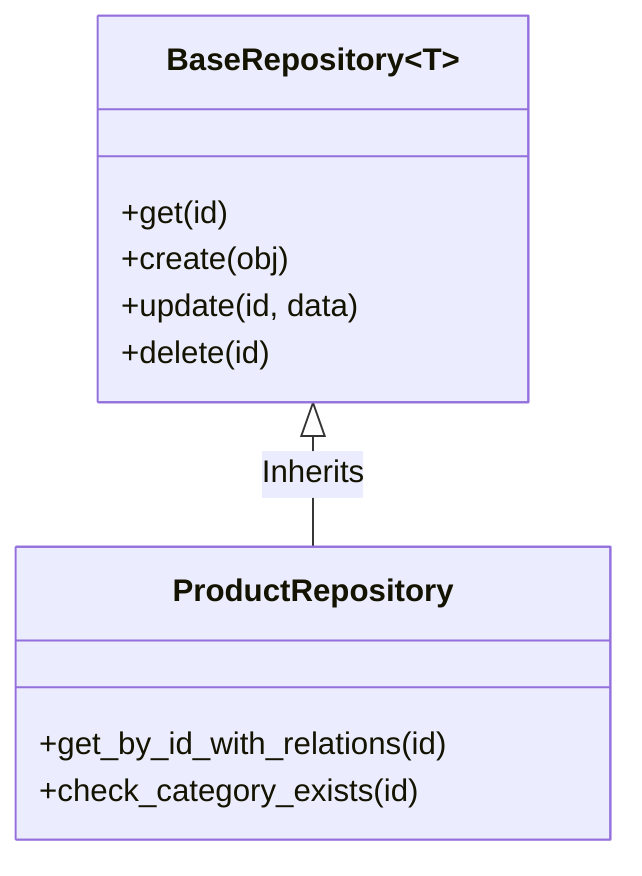

# Análisis de Cumplimiento de Principios SOLID

Este documento detalla cómo el proyecto `fastapi-product` implementa y respeta los principios SOLID, asegurando una arquitectura robusta, mantenible y escalable.

## 1. SRP - Single Responsibility Principle (Principio de Responsabilidad Única)
**"Un módulo debe tener una sola razón para cambiar."**

El proyecto cumple este principio separando estrictamente las capas de la aplicación. Cada archivo tiene un propósito único y definido:

*   **`schemas.py`**: Únicamente define la estructura de datos y validaciones de entrada/salida (Pydantic). No contiene lógica de negocio ni acceso a base de datos.
*   **`models.py`**: Únicamente define la estructura de persistencia en la base de datos (SQLModel).
*   **`routers.py`**: Únicamente maneja la capa de transporte HTTP (rutas, endpoints, códigos de estado). Delega toda la lógica a los servicios.
*   **`service.py`**: Contiene la lógica de negocio pura. No sabe de HTTP ni de SQL directo, coordina las operaciones.
*   **`repository.py`**: Maneja exclusivamente el acceso a datos y consultas a la base de datos.

**Ejemplo:**
En `app/auth/routers.py`, la función `create_user` no contiene lógica de encriptación ni validación de duplicados; simplemente delega esa tarea a `AuthService.create_user`.

## 2. OCP - Open/Closed Principle (Principio Abierto/Cerrado)
**"Las entidades de software deben estar abiertas para su extensión, pero cerradas para su modificación."**

*   **Implementación Clave**: `BaseRepository` (`app/core/repository.py`).
*   **Análisis**: La clase genérica `BaseRepository` implementa operaciones CRUD estándar para cualquier modelo.
*   **Cumplimiento**: Si necesitamos funcionalidades específicas para Productos (ej. `get_all_with_relations`), no modificamos `BaseRepository`. En su lugar, extendemos su funcionalidad creando `ProductRepository(BaseRepository[Product])` y agregamos los nuevos métodos allí. Esto permite añadir nuevas capacidades sin riesgo de romper el código base existente.

## 3. LSP - Liskov Substitution Principle (Principio de Sustitución de Liskov)
**"Las clases hijas deben poder sustituir a las clases padres sin alterar el correcto funcionamiento del programa."**

*   **Implementación**: Herencia de Repositorios.
*   **Análisis**: `ProductRepository` hereda de `BaseRepository`.
*   **Cumplimiento**: Cualquier parte del sistema que espere un `BaseRepository` puede trabajar con un `ProductRepository` sin problemas, ya que este último respeta el contrato de la clase base (métodos `create`, `get`, etc.) sin cambiar su comportamiento esperado ni lanzar excepciones inesperadas. El uso de Tipos Genéricos (`Generic[ModelType]`) refuerza este cumplimiento a nivel de chequeo estático.

## 4. ISP - Interface Segregation Principle (Principio de Segregación de Interfaz)
**"Ningún cliente debe ser forzado a depender de métodos que no utiliza."**

*   **Implementación**: Interfaces de Repositorio Cohesivas.
*   **Análisis**: En lugar de tener una única interfaz masiva de "Acceso a Datos" con cientos de métodos, `BaseRepository` expone solo los métodos CRUD esenciales necesarios para una entidad.
*   **Cumplimiento**: Los servicios no dependen de interfaces gigantes. Cada servicio utiliza un repositorio específico que tiene solo las operaciones que realmente le conciernen. Las dependencias están ajustadas a lo que se necesita.

## 5. DIP - Dependency Inversion Principle (Principio de Inversión de Dependencias)
**"Los módulos de alto nivel no deben depender de módulos de bajo nivel. Ambos deben depender de abstracciones."**

*   **Estado Inicial**: Se identificó una violación en `AuthService` donde se instanciaba la clase directamente.
*   **Corrección Aplicada**: Se refactorizó todo el módulo de autenticación para usar **Inyección de Dependencias**.
*   **Implementación Actual**:
    *   **Servicios**: No crean sus propias instancias de base de datos. Reciben `session: Session` en su constructor.
    *   **Routers**: No instancian servicios directamente (`service = AuthService()`). Utilizan el sistema de inyección de FastAPI (`Depends(get_auth_service)`) para recibir una instancia del servicio ya configurada.
*   **Beneficio**: Esto permite desacoplar la lógica de negocio de la infraestructura concreta, facilitando enormemente las pruebas unitarias (mocking) y el mantenimiento futuro.

---
**Conclusión Generada por Antigravity**
El proyecto demuestra un nivel de madurez alto en su arquitectura, respetando rigurosamente los principios SOLID para garantizar un ciclo de vida de software saludable y sostenible.
