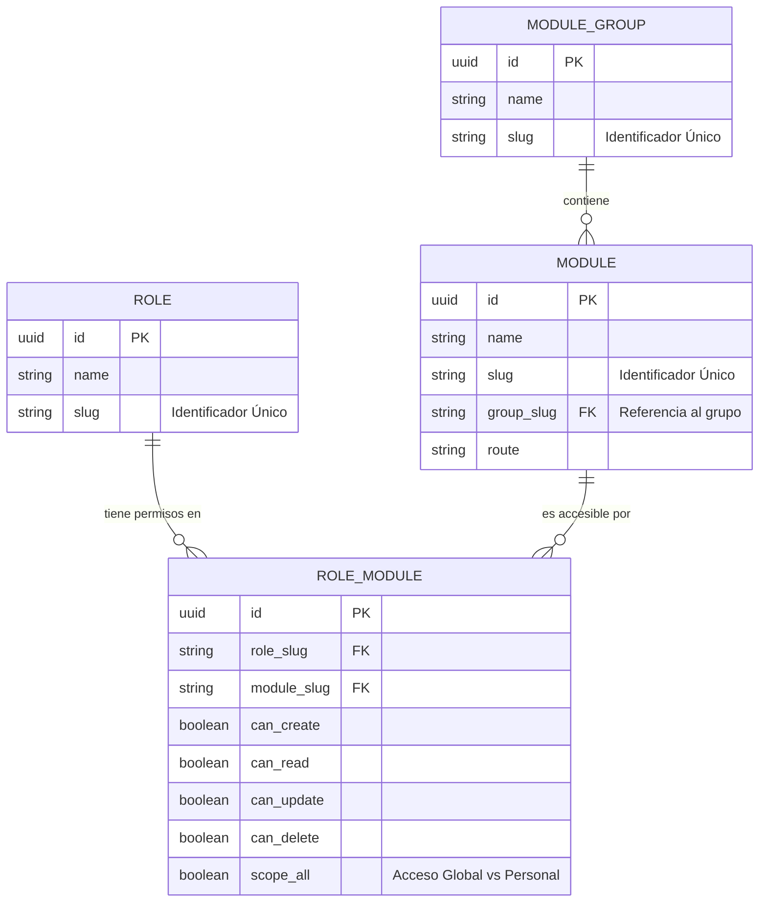

# Guía del Desarrollador: Gestión de Módulos, Roles y Permisos (Seeding)

Esta guía explica el procedimiento estándar para añadir nuevos Grupos de Módulos, Módulos, Roles y asignar Permisos en el backend de Uyuni.

## 1. Conceptos Clave: Sincronización Idempotente (Upsert)

En este proyecto, **NO insertamos módulos ni roles directamente en la base de datos de forma manual**. En su lugar, utilizamos un script de "Sincronización Inteligente" (Idempotent Seed Script). 

*   **¿Qué es Idempotente?** Significa que puedes ejecutar el script 1 o 100 veces, y el resultado final siempre será el correcto: no se duplicarán datos.
*   **¿Cómo funciona?** El script busca si el registro ya existe (por su `slug`). Si existe, actualiza sus datos (Upsert). Si no existe, lo crea. **Nunca borra registros**, lo que protege las llaves foráneas y datos en producción.

---

## 2. Diagrama de Relaciones de Permisos (RBAC)

Para entender qué estamos insertando, debes comprender cómo se relacionan las entidades en la base de datos:



---

## 3. Guía Paso a Paso: Cómo añadir un nuevo Módulo

Todos los cambios deben realizarse en el archivo: `seeds/seed_create_modules.py`.

### Paso 1: Añadir el Grupo (Si es necesario)
Si el módulo pertenece a una nueva categoría, añádela en la función `sync_module_groups`.

```python
# Ejemplo en sync_module_groups()
{
    "name": "Recursos Humanos",
    "slug": "hr",
    "description": "Gestión de Talento",
    "sort_order": 5,
    "icon": "pi pi-users",
    "is_active": True,
}
```

### Paso 2: Añadir el Módulo
Ve a la función `sync_modules` y añade tu nuevo módulo, asegurándote de vincularlo al `group_slug` correcto.

```python
# Ejemplo en sync_modules()
{
    "name": "Planillas",
    "slug": "payroll",
    "description": "Gestión de Pagos",
    "group_slug": "hr", # <-- Apunta al grupo creado arriba
    "sort_order": 1,
    "icon": "pi pi-money-bill",
    "route": "payroll",
    "is_active": True,
}
```

### Paso 3: Asignar Permisos a los Roles
Ve a la función `sync_role_modules` y define qué roles tienen acceso a este nuevo módulo. **Regla de oro: El Administrador del Sistema (`admin`) siempre debe tener acceso a todo nuevo módulo.**

```python
# Ejemplo en sync_role_modules()
# Acceso para Admin
{"role_slug": "admin", "module_slug": "payroll", "scope_all": True, "can_create": True, "can_update": True, "can_delete": True, "is_active": True},

# Acceso limitado para Gestor
{"role_slug": "manager", "module_slug": "payroll", "scope_all": False, "can_create": False, "can_update": False, "can_delete": False, "is_active": True},
```

---

## 4. Ejecución y Sincronización

Una vez que hayas modificado el archivo y guardado los cambios, debes sincronizar tu base de datos local.

Abre tu terminal en la raíz del proyecto y ejecuta:

```bash
venv/bin/python seeds/seed_create_modules.py
```

Deberías ver una salida confirmando la sincronización:
```
✅ ModuleGroups synced
✅ Roles synced
✅ Modules synced
✅ RoleModules synced
```

### 5. Flujo de Trabajo en Equipo (Git)
1. Desarrollador A añade el módulo en el script y hace `git commit`.
2. Desarrollador B hace `git pull` para bajar los cambios.
3. Desarrollador B ejecuta el script de sincronización.
4. **Resultado:** Ambos desarrolladores tienen la misma estructura de menús y permisos sin tocar la base de datos manualmente.
