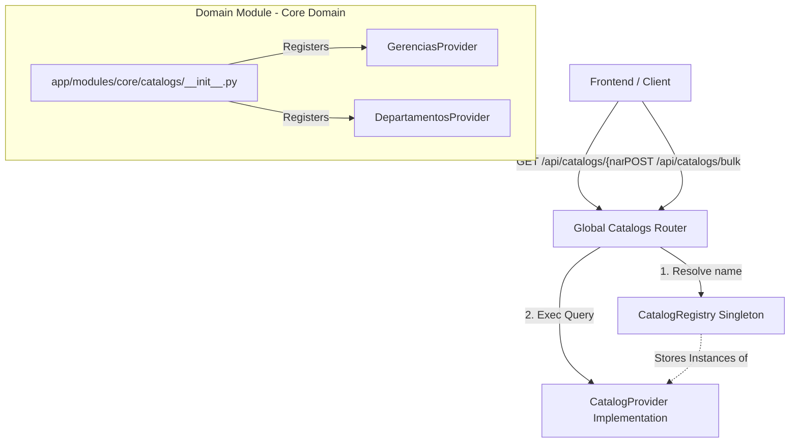
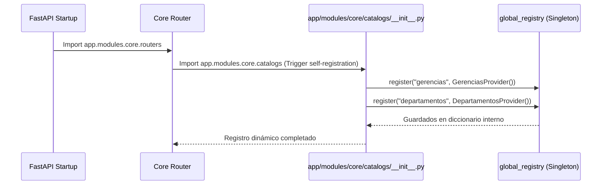
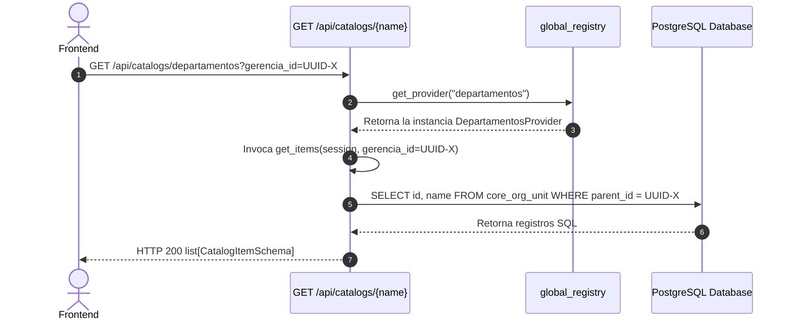
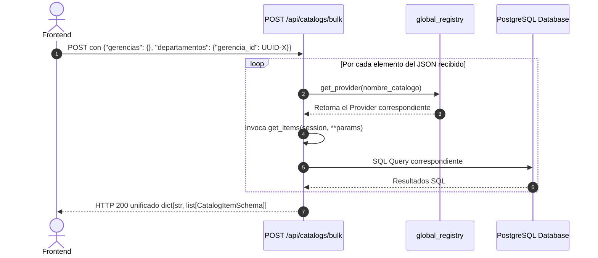

# Guía de Desarrollo: Sistema de Catálogos Dinámicos Modulares

El sistema de **Catálogos Dinámicos Modulares** de Uyuni Backend es una solución de alto rendimiento diseñada para poblar selectores (dropdowns, combos y filtros) en el frontend de manera dinámica, desacoplada e independiente.

Esta guía está diseñada didácticamente para que **desarrolladores de todos los niveles (desde Junior hasta Senior)** puedan entender la lógica, arquitectura, flujo de ejecución y cómo extenderla sin fricción.

---

## 🎯 ¿Qué problema resuelve?

En sistemas empresariales complejos, un solo formulario de registro puede requerir cargar múltiples listados auxiliares (ej. *gerencias, departamentos, puestos, estados de activos, etc.*). 

*   **El Enfoque Tradicional (Malo):** El frontend realiza 10 llamadas HTTP individuales concurrentes a 10 endpoints distintos. Esto satura el pool de conexiones, incrementa la latencia de carga y genera un código de enrutamiento repetitivo (*boilerplate*) en el backend.
*   **Nuestro Enfoque Híbrido (Óptimo):** Centralizamos las llamadas de red mediante un **único punto de entrada global** que expone consultas individuales (`GET /api/catalogs/{name}`) y consultas masivas en lote (`POST /api/catalogs/bulk`). Con una sola petición HTTP, el frontend puede poblar un formulario completo de golpe, delegando la obtención de datos a proveedores especializados en el backend.

---

## 🏛️ Diseño Arquitectónico (Para Seniors)

El sistema se basa en el patrón de **Registro Desacoplado con Auto-registro** (Decoupled Registration with Self-Registration). Cada módulo de dominio (Core, Assets, Tasks, etc.) es el dueño absoluto de sus consultas de catálogos y se encarga de registrarlas de manera autónoma.

### Mapa de Capas del Sistema (Corregido)



### Componentes Clave y Rutas de Archivos Relativas

1.  **El Protocolo (`CatalogProvider`)** en [base.py](../../app/core/catalogs/base.py):
    Define la "firma" o interfaz de programación. Cualquier clase que implemente `get_items(self, session: Session, **kwargs)` es considerada un proveedor de catálogo válido.
2.  **El DTO Estándar (`CatalogItemSchema`)** en [schemas.py](../../app/core/catalogs/schemas.py):
    Estructura JSON unificada que retorna la API:
    *   `value`: El identificador de la base de datos (generalmente un `UUID` o `int`).
    *   `label`: El texto amigable legible por el usuario (ej. *"Gerencia de TI"*).
    *   `extra`: Metadatos auxiliares opcionales (`dict[str, Any]`).
3.  **La Libreta de Contactos (`CatalogRegistry`)** en [registry.py](../../app/core/catalogs/registry.py):
    Un diccionario en memoria que empareja una clave de texto (`slug`) con su proveedor respectivo en Python. Expone el objeto único `global_registry`.
4.  **El Enrutador Central (`routers.py`)** en [routers.py](../../app/core/catalogs/routers.py):
    Expone los endpoints públicos `/api/catalogs/...` y resuelve dinámicamente las consultas haciendo búsquedas en `global_registry`.

---

## 🔄 Flujo de Trabajo e Inicialización (Para Juniors)

Si te preguntas *"¿cómo sabe el backend qué clase de Python ejecutar cuando mando una palabra en el JSON?"*, aquí tienes la explicación detallada de cómo se asocia en memoria:

### 🔍 La analogía del "Directorio Telefónico" (Cómo se asocia el JSON al Código)

Imagina que el sistema tiene una libreta de contactos en memoria llamada `global_registry`. Esta libreta asocia un **nombre de catálogo (String)** con una **instancia del proveedor (Clase Python)**.

1. **El Registro en memoria (Startup):** Al arrancar el servidor, el archivo `app/modules/core/catalogs/__init__.py` inscribe las relaciones:
   ```python
   global_registry.register("gerencias", GerenciasProvider())
   global_registry.register("departamentos", DepartamentosProvider())
   ```
   Nuestra "libreta de contactos" (`global_registry._providers`) queda guardada en memoria exactamente así:
   ```python
   {
       "gerencias": GerenciasProvider(),
       "departamentos": DepartamentosProvider()
   }
   ```

2. **El viaje del JSON en el Router:** Cuando envías una petición en lote (Bulk) con este cuerpo JSON:
   ```json
   {
     "gerencias": {},
     "departamentos": {"gerencia_id": "UUID-X"}
   }
   ```
   FastAPI recibe este JSON y lo convierte en un diccionario de Python. El enrutador global de Core en `app/core/catalogs/routers.py` recorre este diccionario llave por llave:
   ```python
   for catalog_name, params in request_data.items():
       provider = global_registry.get_provider(catalog_name)
       result[catalog_name] = provider.get_items(session, **params)
   ```

3. **Resolución dinámica:**
   * **Iteración 1:** Toma la llave `"gerencias"`. Llama a `global_registry.get_provider("gerencias")` y obtiene el objeto `GerenciasProvider()`. Ejecuta su método `.get_items(session)` y guarda los resultados.
   * **Iteración 2:** Toma la llave `"departamentos"`. Llama a `global_registry.get_provider("departamentos")` y obtiene el objeto `DepartamentosProvider()`. Ejecuta su método `.get_items(session, gerencia_id="UUID-X")` y guarda los resultados.

4. **Control de Errores e Inexistencias:** ¿Qué pasa si mandas por error una llave inexistente como `"gerencias2"`? El método `get_provider("gerencias2")` valida si la clave existe en el diccionario en memoria. Al no encontrarla, lanza de forma segura una excepción `NotFoundException` que responde al cliente con un HTTP 404: `"Catalog 'gerencias2' not found"` evitando errores de ejecución imprevistos.

---

### 1. Inicialización y Auto-registro en el Startup de la App

Cuando inicias FastAPI, el servidor importa los routers de los módulos. Al importar el router agregador de Core ([routers.py](../../app/modules/core/routers.py)), se gatilla un import silencioso del submódulo de catálogos ([__init__.py](../../app/modules/core/catalogs/__init__.py)).



### 2. Consulta de un Catálogo Genérico Simple (GET)



### 3. Consulta de Carga Masiva (POST Bulk)

Si el frontend necesita cargar ambos dropdowns en una sola petición:



---

## 💻 Manual Práctico: Cómo crear un nuevo catálogo paso a paso

Para incorporar un nuevo catálogo al sistema (por ejemplo, un listado de **Cargos Ocupacionales / Positions**), sigue estos 3 simples pasos:

### Paso 1: Crea el Proveedor (`providers.py`)
Escribe tu clase de consulta en el archivo de proveedores del módulo de negocio correspondiente. 

*Ruta:* [app/modules/core/catalogs/providers.py](../../app/modules/core/catalogs/providers.py)

```python
from sqlmodel import Session, select
from app.core.catalogs.base import CatalogProvider
from app.core.catalogs.schemas import CatalogItemSchema
from app.modules.core.positions.models import Position  # Tu modelo de DB

class CargosProvider(CatalogProvider):
    def get_items(self, session: Session, **kwargs) -> list[CatalogItemSchema]:
        """
        Recupera todos los cargos ocupacionales activos de la empresa.
        """
        # 1. Armamos el SELECT trayendo únicamente los campos necesarios
        query = select(Position.id, Position.name).where(
            Position.is_active == True
        ).order_by(Position.name)
        
        # 2. Ejecutamos la consulta en la DB
        results = session.exec(query).all()
        
        # 3. Retornamos mapeando al esquema estándar
        return [CatalogItemSchema(value=r[0], label=r[1]) for r in results]
```

### Paso 2: Registrar el Proveedor en el inicializador (`__init__.py`)
Abre el constructor de catálogos de tu módulo de dominio e inscribe tu clase en la libreta global.

*Ruta:* [app/modules/core/catalogs/__init__.py](../../app/modules/core/catalogs/__init__.py)

```python
from app.core.catalogs.registry import global_registry
from app.modules.core.catalogs.providers import (
    DepartamentosProvider,
    GerenciasProvider,
    CargosProvider,  # 1. Importas tu proveedor
)

# 2. Lo agregas al registry global asignándole un identificador de texto único ("cargos")
global_registry.register("gerencias", GerenciasProvider())
global_registry.register("departamentos", DepartamentosProvider())
global_registry.register("cargos", CargosProvider())  # <-- ¡Agregado!
```

### Paso 3: Disparar el Auto-registro
Asegúrate de que el router agregador del módulo importe silenciosamente el paquete de catálogos para que Python ejecute la carga de `__init__.py` al levantar el servidor.

*Ruta:* [app/modules/core/routers.py](../../app/modules/core/routers.py)

```python
from fastapi import APIRouter

# Importación silenciosa indispensable
import app.modules.core.catalogs  # noqa: F401
...
```

¡Eso es todo! Sin tocar controladores de red, código HTTP ni validaciones de rutas, tu catálogo `"cargos"` ya está expuesto en los endpoints globales.

---

## 🧪 Pruebas Unitarias

Siempre debes agregar pruebas para asegurar la estabilidad de la API. Escribe tu caso de prueba dentro de [test_catalogs.py](../../tests/test_catalogs.py):

```python
def test_get_cargos_success(client: TestClient, superuser_token_headers: dict):
    # Probamos la consulta individual (GET)
    response = client.get("/api/catalogs/cargos", headers=superuser_token_headers)
    assert response.status_code == 200
    
    # Probamos la consulta masiva (POST Bulk)
    payload = {"cargos": {}}
    response = client.post("/api/catalogs/bulk", json=payload, headers=superuser_token_headers)
    assert response.status_code == 200
    assert "cargos" in response.json()
```

Para correr las pruebas locales:
```bash
venv/bin/pytest tests/test_catalogs.py
```

---

## 📋 Ejemplos de Intercambio de Datos (REST API)

### 1. Consulta GET Simple
*   **Request:** `GET /api/catalogs/gerencias`
*   **Response (HTTP 200):**
    ```json
    [
      {
        "value": "019e2c7a-cc93-73bd-b877-623043fe07ef",
        "label": "GERENCIA REGIONAL POTOSÍ",
        "extra": null
      }
    ]
    ```

### 2. Consulta POST Bulk (En lote)
*   **Request:** `POST /api/catalogs/bulk`
*   **Request Body:**
    ```json
    {
      "gerencias": {},
      "departamentos": {
        "gerencia_id": "019e2c7a-cc93-73bd-b877-623043fe07ef"
      }
    }
    ```
*   **Response (HTTP 200):**
    ```json
    {
      "gerencias": [
        {
          "value": "019e2c7a-cc93-73bd-b877-623043fe07ef",
          "label": "GERENCIA REGIONAL POTOSÍ",
          "extra": null
        }
      ],
      "departamentos": [
        {
          "value": "019e2c7a-cc94-7c12-a6c0-bcc390f8fbd3",
          "label": "UNIDAD JURÍDICA",
          "extra": null
        }
      ]
    }
    ```
