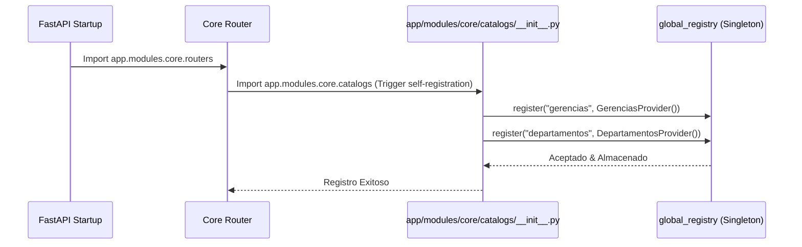
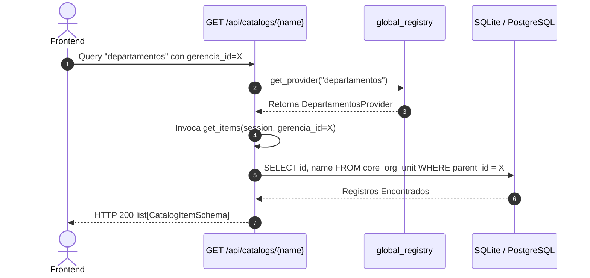
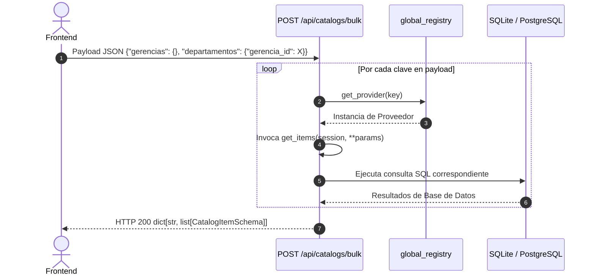

# Guía de Desarrollo: Sistema de Catálogos Dinámicos Modulares

El sistema de **Catálogos Dinámicos Modulares** de Uyuni Backend es una solución de alto rendimiento diseñada para poblar elementos selectbox, combos y filtros del frontend de manera dinámica, modular e independiente. 

Esta arquitectura híbrida resuelve el problema común en desarrollos empresariales donde poblar un formulario complejo requiere realizar decenas de llamadas HTTP concurrentes al servidor. Permite resolver consultas individuales o de lote (**Bulk**) bajo un único enrutador e infraestructura global sin generar dependencias circulares ni boilerplate de controladores.

---

## 🏛️ Diseño Arquitectónico

El sistema se basa en el patrón de **Registro Desacoplado con Auto-registro** (Decoupled Registration with Self-Registration). Cada módulo de dominio (Core, Assets, Tasks, etc.) es dueño absoluto de sus consultas de catálogos y se encarga de registrarlas en la infraestructura de Core durante la inicialización de la aplicación.

### Mapa de Capas del Sistema

```mermaid
graph TD
    Client[Frontend / Client] -->|GET /api/catalogs/{name}| GlobalRouter[Global Catalogs Router]
    Client -->|POST /api/catalogs/bulk| GlobalRouter
    GlobalRouter -->|1. Resolve name| Registry[CatalogRegistry Singleton]
    GlobalRouter -->|2. Exec Query| Provider[CatalogProvider Implementation]
    Registry -->|Imports & Registers| DomainModule[app/modules/core/catalogs/__init__.py]
    DomainModule -->|Provides| Gerencias[GerenciasProvider]
    DomainModule -->|Provides| Departamentos[DepartamentosProvider]
```

### Componentes Clave

1.  **`CatalogProvider` (Protocolo - [base.py](file:///opt/uyuni/uyuni-backend-py/app/core/catalogs/base.py))**:
    Protocolo de Python que define la interfaz estructural de un proveedor de catálogos. Cualquier clase que exponga la firma `get_items(self, session: Session, **kwargs)` es un proveedor de catálogos válido.
2.  **`CatalogItemSchema` (DTO - [schemas.py](file:///opt/uyuni/uyuni-backend-py/app/core/catalogs/schemas.py))**:
    Esquema estándar de intercambio de datos:
    *   `value`: Cualquier tipo primitivo (generalmente `UUID` o `int`).
    *   `label`: Texto legible que verá el usuario final (ej. *"Gerencia de TI"*).
    *   `extra`: Diccionario opcional `dict[str, Any]` para retornar información de contexto adicional (metadatos).
3.  **`CatalogRegistry` (Registro Singleton - [registry.py](file:///opt/uyuni/uyuni-backend-py/app/core/catalogs/registry.py))**:
    Diccionario centralizado en memoria que asocia slugs únicos con instancias de `CatalogProvider`. Expone la instancia global unificada `global_registry`.
4.  **Enrutador Global ([routers.py](file:///opt/uyuni/uyuni-backend-py/app/core/catalogs/routers.py))**:
    Mapeado a la ruta base de red `/api/catalogs`. Ofrece dos endpoints dinámicos protegidos por autenticación básica JWT:
    *   `GET /{catalog_name}`: Resuelve un catálogo individual traduciendo parámetros URL.
    *   `POST /bulk`: Recibe un cuerpo JSON estructurado y resuelve múltiples catálogos en una sola petición HTTP.

---

## 🔄 Flujo de Trabajo y Secuencia

### 1. Inicialización y Auto-registro en Startup

FastAPI importa los enrutadores principales de la aplicación al arrancar. Cuando se importa el router agregador de un módulo (como `app/modules/core/routers.py`), se ejecuta la importación silenciosa de su inicializador de catálogos:



### 2. Consulta Genérica Simple (GET)



### 3. Consulta de Carga Masiva (POST Bulk)



---

## 💻 Manual Práctico del Desarrollador: Cómo agregar un nuevo Catálogo

Para incorporar un nuevo catálogo al sistema (por ejemplo, un listado de "roles" o "cargos"), debes seguir únicamente 3 simples pasos:

### Paso 1: Crear la Clase del Proveedor (`providers.py`)

Añade tu proveedor heredando de `CatalogProvider` dentro del submódulo de catálogos correspondiente de tu dominio. 

*Ejemplo: `app/modules/core/catalogs/providers.py`*

```python
from sqlmodel import Session, select
from app.core.catalogs.base import CatalogProvider
from app.core.catalogs.schemas import CatalogItemSchema
from app.modules.core.positions.models import Position  # Tu modelo de DB

class CargosProvider(CatalogProvider):
    def get_items(self, session: Session, **kwargs) -> list[CatalogItemSchema]:
        """
        Recupera todos los cargos ocupacionales activos del sistema.
        """
        # 1. Armamos la consulta optimizada (trayendo solo id y name)
        query = select(Position.id, Position.name).where(
            Position.is_active == True
        ).order_by(Position.name)
        
        # 2. Ejecutamos contra la sesión
        results = session.exec(query).all()
        
        # 3. Retornamos mapeando cada fila al esquema CatalogItemSchema
        return [CatalogItemSchema(value=r[0], label=r[1]) for r in results]
```

### Paso 2: Registrar el Proveedor en su Inicializador (`__init__.py`)

Agrega el nuevo catálogo al inicializador del módulo para que se auto-registre de forma global durante la carga de la aplicación.

*Archivo: `app/modules/core/catalogs/__init__.py`*

```python
from app.core.catalogs.registry import global_registry
from app.modules.core.catalogs.providers import (
    DepartamentosProvider,
    GerenciasProvider,
    CargosProvider,  # 1. Importamos
)

# 2. Auto-registro en el Registry Global
global_registry.register("gerencias", GerenciasProvider())
global_registry.register("departamentos", DepartamentosProvider())
global_registry.register("cargos", CargosProvider())  # 3. Registramos con su clave única
```

> [!NOTE]
> La clave asignada en el método `register("cargos", ...)` será el identificador exacto que se utilizará tanto en la ruta GET (`/api/catalogs/cargos`) como en el payload del POST de lote (`POST /api/catalogs/bulk`).

### Paso 3: Asegurar la Carga en el Router Principal (`routers.py` del Dominio)

Verifica que el router principal del dominio tenga el import de inicialización. Esto asegura que Python ejecute el código de registro en memoria.

*Archivo: `app/modules/core/routers.py`*

```python
from fastapi import APIRouter

# Importación silenciosa indispensable para disparar el auto-registro
import app.modules.core.catalogs  # noqa: F401
...
```

¡Eso es todo! El catálogo `"cargos"` ya se encuentra disponible de forma inmediata en toda la API global del sistema sin haber tocado un solo controlador HTTP o archivo de enrutador.

---

## 🧪 Pruebas Unitarias

Para mantener una calidad del 100% y validar que tus catálogos no rompan el sistema, puedes añadir una prueba rápida en `tests/test_catalogs.py`:

```python
def test_get_cargos_success(client: TestClient, superuser_token_headers: dict):
    # Probando Endpoint Individual
    response = client.get("/api/catalogs/cargos", headers=superuser_token_headers)
    assert response.status_code == 200
    
    # Probando Endpoint Bulk
    payload = {"cargos": {}}
    response = client.post("/api/catalogs/bulk", json=payload, headers=superuser_token_headers)
    assert response.status_code == 200
    assert "cargos" in response.json()
```

Para correr las pruebas locales, ejecuta desde la raíz:
```bash
venv/bin/pytest tests/test_catalogs.py
```

---

## 📋 Ejemplos de Peticiones y Respuestas REST

### 1. Obtener Catálogo de Gerencias (Individual GET)
*   **Request:**
    ```http
    GET /api/catalogs/gerencias HTTP/1.1
    Authorization: Bearer <token_jwt>
    ```
*   **Response (HTTP 200):**
    ```json
    [
      {
        "value": "4f9712a1-cf01-4478-8319-75a2d67ea55b",
        "label": "Gerencia de RRHH",
        "extra": null
      },
      {
        "value": "7b0811b2-df02-4579-9420-86b3e78fb66c",
        "label": "Gerencia de TI",
        "extra": null
      }
    ]
    ```

### 2. Carga en Lote de Múltiples Catálogos (Bulk POST)
*   **Request:**
    ```http
    POST /api/catalogs/bulk HTTP/1.1
    Authorization: Bearer <token_jwt>
    Content-Type: application/json

    {
      "gerencias": {},
      "departamentos": {
        "gerencia_id": "7b0811b2-df02-4579-9420-86b3e78fb66c"
      }
    }
    ```
*   **Response (HTTP 200):**
    ```json
    {
      "gerencias": [
        {
          "value": "4f9712a1-cf01-4478-8319-75a2d67ea55b",
          "label": "Gerencia de RRHH",
          "extra": null
        },
        {
          "value": "7b0811b2-df02-4579-9420-86b3e78fb66c",
          "label": "Gerencia de TI",
          "extra": null
        }
      ],
      "departamentos": [
        {
          "value": "bc9933a1-1234-abcd-ef00-998877665544",
          "label": "Departamento de Desarrollo",
          "extra": null
        },
        {
          "value": "ca8822b2-5678-efab-cd11-aabbccddeeff",
          "label": "Departamento de Sistemas",
          "extra": null
        }
      ]
    }
    ```
